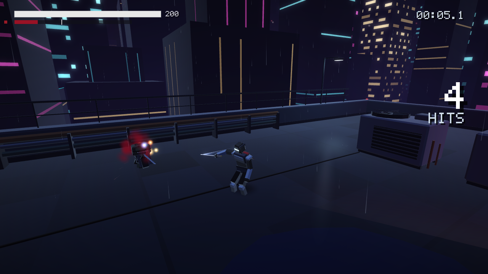
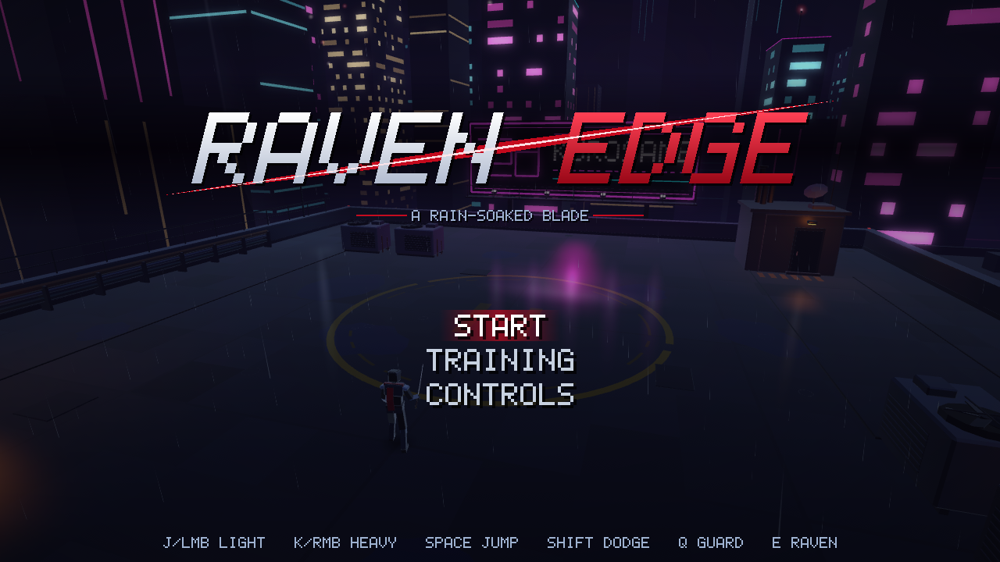
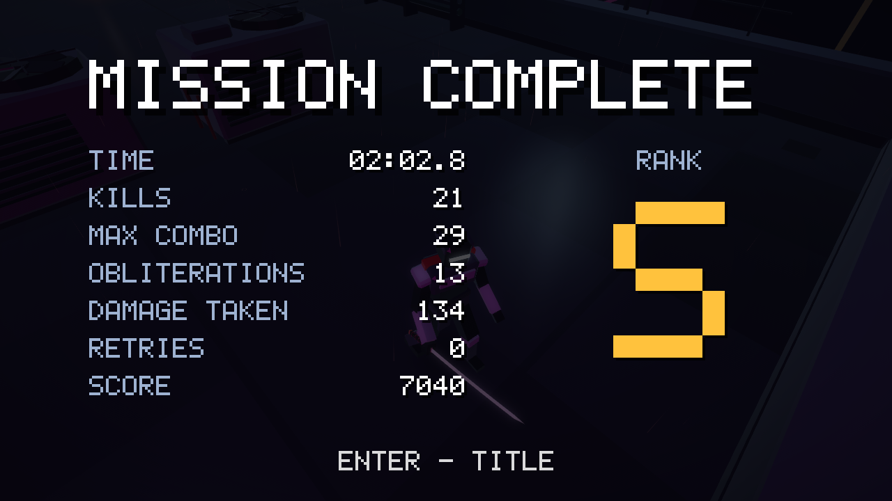
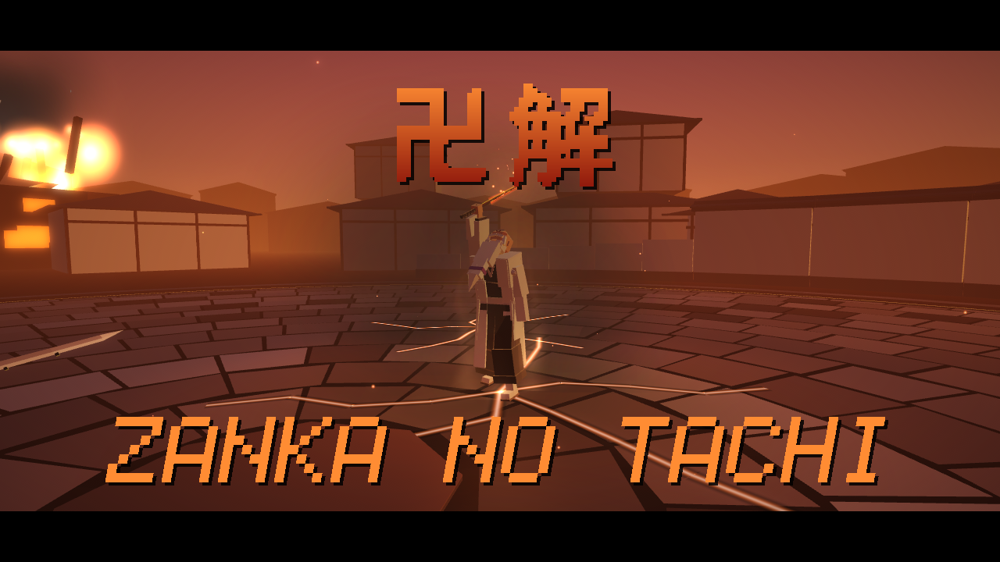
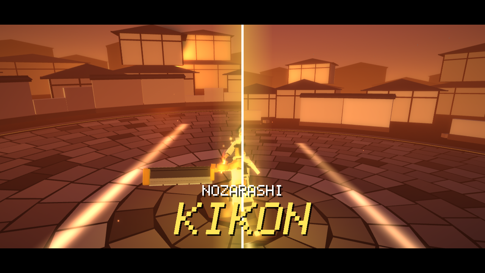

# RAVEN EDGE

用 Common Lisp 寫的網頁 3D 動作遊戲，玩法參考《忍者外傳 4》（Ninja Gaiden 4），同時也是一份教材：它示範怎麼用 Lisp 做一個小型遊戲引擎，再用這個引擎做出一款完整的遊戲；之後又用同一個引擎做了第二款、類型完全不同的格鬥遊戲 SOUL DUEL（見下方）。

Lisp 原始碼先由 ECL 編成 C，再由 Emscripten 編成 WebAssembly，在瀏覽器裡執行。畫面透過 SDL3 的 SDL_GPU（WebGPU 後端）繪製。所有模型都是程式產生的低面數幾何，音效和配樂在啟動時即時合成，整個專案沒有任何美術或音訊素材檔。

舞台是下著血色雨的近未來都市頂樓。你扮演最後一名忍者 REN，連砍三波「雨之軍團」，最後對上頭目 ENRA。



| 標題畫面 | 結算畫面 |
|---|---|
|  |  |

截圖都是無頭 Chrome（SwiftShader 軟體算圖）在 1280×720 下自動拍的，檔案在 `tests/shots/`。`gpu-*` 是現在的 SDL_GPU 版；`e2-*` 與 `webgl-*` 是改用 SDL_GPU 之前的 WebGL2 版，兩者畫面一致。

## 第二款遊戲：SOUL DUEL

同一個引擎上的第二款遊戲，類型完全不同：1 對 1 的 3D 競技場格鬥，玩法參考《BLEACH: Rebirth of Souls》，由《千年血戰篇》（TYBW）的山本元柳齋對上更木劍八。可以人對電腦、雙人同機對戰，或看兩個電腦對打。做它有兩個目的：用第二種類型的遊戲找出引擎的缺口並補上，再把兩款遊戲都用得到的東西收回引擎（過程見 DEVLOG 第 14 節）。


| 卍解・殘火太刀 | 野晒的 Kikon（天空被劈開） |
|---|---|
|  |  |

```sh
./build.sh duel                              # 建出 dist/duel/
python3 -m http.server -d dist/duel 8000     # 用 Chrome 開 http://localhost:8000/
```

- **規則**：雙方各有 1300 點靈子（Reishi，血條）和 9 個魂魄（Konpaku，命）。按 O 是 Kikon（鬼魂）突進：角色衝上去砍一刀，站著、走路、跑步時都能用；連段的第三段打中之後按 O 是「O 收尾」，跳過瞄準直接出刀、一定連得上（其他招式都不能再取消成 O）。對手沒變紅時，這一刀跟一般攻擊一樣能被擋（被擋住 −14，會被反擊）；對手的靈子掉到 30% 以下變紅後就擋不住（閃步和 Hoho 的無敵幀還是躲得掉），而且砍中那一刻 O 還按著，才會真正發動 Kikon，一次打掉 2 個魂魄（覺醒後 3 個）；先放開的話只是一般的一刀。靈子歸零自動多打掉 1 個（Soul Break）。魂魄打光就輸，時限 300 秒。
- **猜拳**：防禦擋攻擊、攻擊打斷 Breaker、Breaker 破防；兩邊同時 Breaker 會互彈（CLASH）。步法（Hoho）瞬移到對手背後，時機抓準會觸發慢動作反擊（PERFECT）。
- **角色**：山本用火焰壓制距離，Inferno 量表滿了進入獄焱（Hellfire）；覺醒是卍解（持續到比賽結束，此後不再有 Inferno 和獄焱），分成東（旭日刃：線狀快攻，攻擊帶「穿透」、防禦量表越滿越痛，被擋也有一部分穿過防禦，但受傷 ×1.5）與西（殘日獄衣：全身包著紅焰，全方位防禦而且沒有防禦硬直，量表不會回，Shift+K 是招架）兩個架式：在東按 U 切到西，在西出 L、SP1 以外的招式就回到東；L 各有新招（東「旭光」突刺、西「焦熱地獄」火柱環）。劍八近身猛攻，越被逼到絕境越強；覺醒是野晒，同樣持續到比賽結束。
- **操作**（完整對照表在 [docs/duel/DUEL_GAMEPLAY.md](docs/duel/DUEL_GAMEPLAY.md)）：P1 用 W A S D 移動，J 輕攻擊、K 重攻擊（J／K 組成最多三段的連段，J／K 最多換一次；每一段要碰到對手才接得下去，揮空就停在那一刀，見 [docs/duel/DUEL_STRINGS.md](docs/duel/DUEL_STRINGS.md)；自己的防禦量表越少，打中或被擋時拿到的靈壓和瞬步越多），L 招牌技、U 防禦、I Breaker、O Kikon 突進（砍中時仍按住：對手被擊退，自己衝上去補一刀＝Kikon；對手沒變紅時可以在衝刺中防禦擋下）、Space 閃步（Step，按住不放就接著衝刺），P 覺醒，按住左 Shift 再按 K／L／Space 是 SP1／SP2／Hoho；被連段打中第 2 下之後按 Shift+J 是 Burst Reverse（花 70 閃步量表，藍色衝擊波把對手推開）；卍解時 Shift+L 是南・定身技。P2 用方向鍵加數字鍵盤（KP1～KP6、KP0、KP Enter、KP +），也可以各接一支手把。Esc 暫停。對電腦時鏡頭預設在 P1 背後（W 就是衝向對手），暫停選單和選難度的畫面可以切回側面鏡頭。

這是**非商業的同人練習作品**（fan study）：角色與招式名稱是應使用者要求使用的，所有模型、動作、特效、音效與配樂都由程式產生，沒有使用原作動畫或遊戲的任何素材。設計與數值見 [docs/duel/DUEL_DESIGN.md](docs/duel/DUEL_DESIGN.md)。

## 快速開始

```sh
./build.sh                                   # 建出 dist/game/（遊戲）
python3 -m http.server -d dist/game 8000     # 用 Chrome 開 http://localhost:8000/
```

`dist/game/` 只有 `index.html`、`index.js`、`index.wasm` 三個檔案（wasm 約 5.6 MB），任何靜態伺服器都能放。直接用 `file://` 開不行，瀏覽器不讓頁面這樣載入 wasm。第一次點擊或按鍵之後才會有聲音，這是瀏覽器的自動播放限制。

其他建置目標：

```sh
./build.sh duel                   # 第二款遊戲 SOUL DUEL → dist/duel/
./build.sh examples/hello         # 最小的範例遊戲 → dist/hello/（教材從這裡開始）
./build.sh examples/engine-demo   # 引擎的算圖、特效、UI 展示 → dist/engine-demo/
./build.sh NAME a.lisp b.c        # 引擎加上指定檔案，建一個測試目標 dist/NAME/
GAME_OPT=-O1 ./build.sh           # 改 Lisp 產生的 C 的最佳化等級（預設 -O2）
EMCC_EXTRA="..." ./build.sh       # 額外的 emcc 連結參數
```

Lisp 編譯錯誤會印在終端機，完整記錄在 `build/NAME/lisp.log`。錯誤行號指向串接後的 `build/NAME/game-all.lisp`，每個原始檔開頭都有 `;;;; ---- engine/lisp/xxx.lisp` 這類標記方便對照。

### 測試

```sh
node tools/run.mjs dist/game --secs 12 --shot out.png      # 無頭 Chrome 跑 12 秒並截圖
python3 tests/scripts/e2.py                                # 產生情境腳本 tests/scripts/e2-*.json
node tools/run.mjs dist/game --secs 30 --script tests/scripts/e2-grunt.json
tools/pkgcheck.sh game                                     # 找出未 export 的引擎名稱、覆蓋引擎的定義、未定義的函式

E=/media/8tsp/projects/ecl-24.5.10/ecl-emscripten-host/bin/ecl   # 主機上的純 Lisp 測試，不用建置
$E --norc --load tests/ecs-test.lisp               # ECS
$E --norc --load tests/rules-test.lisp             # RAVEN EDGE 的規則
$E --norc --load engine/lisp/package.lisp --load engine/lisp/math.lisp --load tests/test-math.lisp
$E --norc --load tests/input-test.lisp             # 引擎的虛擬手把（vpad），31 項
$E --norc --load tests/cine-test.lisp              # 引擎的過場導演，18 項
$E --norc --load tests/duel-rules-test.lisp        # SOUL DUEL 的規則與招式表，575 項
$E --norc --load tests/duel-control-test.lisp      # SOUL DUEL 的操作與指令表，53 項
```

`tools/run.mjs` 不需要安裝任何套件。它起一個小 HTTP 伺服器，用 DevTools 協定開無頭 Chrome（WebGPU 走 SwiftShader 的 Vulkan 軟體實作，預設參數寫在腳本裡，`CHROME_FLAGS` 可覆寫），把 console 輸出轉到終端機，照腳本在指定時間送出按鍵、滑鼠、`eval`，並拍截圖。頁面丟出 JS 例外時結束碼是 1。

測試腳本由 `tests/scripts/` 的 `gen.py`（玩家招式）、`e2.py`（敵人與遊戲流程）、`p3.py`（各畫面與長時間浸泡測試）和 `gpu.py`（SDL_GPU 版的截圖組）產生。腳本透過 `Module._debug_cmd(n)` 跳到指定波次、強制敵人出某一招、開無敵，或讓自動遊玩的 bot 從頭打到尾。指令清單在 [docs/raven-edge/GAMEPLAY.md](docs/raven-edge/GAMEPLAY.md)。

SOUL DUEL 的腳本由 `python3 tests/scripts/duel.py` 產生：固定種子的電腦對戰（`duel-cvc-*.json`，同一個種子每次跑出一模一樣的比賽）、60 場的節奏測試（`duel-gate.json`）、幀數探針（`duel-probe.json`）、鍵盤、選單流程、效能與截圖組。說明與除錯指令在 [docs/duel/DUEL_GAMEPLAY.md](docs/duel/DUEL_GAMEPLAY.md)。

## 資料夾

```
engine/      可重複使用的引擎（ENGINE 套件），不知道任何一款遊戲的存在
  lisp/        數學、命中判定（hitvol）、虛擬手把（input）、平台、算圖、模型產生、UI、音訊、動畫、
               剛體角色（body）、時間與固定步長、特效、過場導演（cine）、ECS、app（RUN-GAME）
  c/           engine.h（Lisp 呼叫的所有 C 函式）、main.c（啟動 ECL、GC、主迴圈）、platform.c、render.c、audio.c、rng.c
  shaders/     所有 WGSL 著色器（共用片段用 // #include）
  web/         HTML 外殼：向瀏覽器要 WebGPU 裝置、載入進度、錯誤畫面
  MANIFEST     引擎原始檔的編譯順序
game/        RAVEN EDGE（RAVEN 套件）
  lisp/        元件（components）、純函式規則（rules）、系統（player、enemy、combat、projectiles、feedback……）
               與資料檔（moves、bodies、clips、sounds、tuning）
  c/           雨、霓虹倒影、水花、碰撞、射線（world.c）
  MANIFEST     遊戲原始檔的編譯順序，第一行 `# title: RAVEN EDGE`
duel/        SOUL DUEL（DUEL 套件）
  lisp/        規則、操作、角色資料（kit、yama、ken）、美術、系統（fighter、combat、hazards、ai……）、過場
  MANIFEST     第一行 `# title: SOUL DUEL`
examples/
  hello/       最小的完整遊戲，123 行，教材的起點
  engine-demo/ 只用引擎的展示：頂樓、環繞鏡頭、特效、UI
```

其餘目錄：`tools/`（`build.lisp` 編譯腳本、`run.mjs` 無頭測試器、`pkgcheck.sh`、原生模擬的 `simgate.py`、`aieval.py`、`assistgate.py`、`deploy-pages.sh`、vendor 腳本、`pose-solve.py`，用途表見 AGENTS.md）、`tests/`（主機測試、wasm demo、腳本產生器、截圖）、`vendor/`（wasm 版 ECL、帶 WebGPU 後端的 SDL3、Dawn 的 emdawnwebgpu）、`docs/`（文件，依主題分資料夾）、`skills/`（六個 Claude skill）、`babylon/`（已停止的 TypeScript 移植版）、`build/` 與 `dist/`（建置產物）。

每個建置目標是一個有 `MANIFEST` 的目錄：一行一個原始檔，依序編譯；`.lisp` 檔（引擎在前）串成一個編譯單元交給 ECL，`.c` 檔在連結時交給 emcc。為什麼這樣做，見教材第 1 步。

## 學習路徑

想知道這一切怎麼運作，從 **[docs/guides/TUTORIAL.zh-TW.md](docs/guides/TUTORIAL.zh-TW.md)** 開始。它帶你建置並從頭讀完 `examples/hello`，再依序看幀迴圈與 GC、ECS、純函式規則、事件、算圖，讀懂 RAVEN EDGE 的一下攻擊怎麼從招式資料一路變成畫面上的血霧和音效，接著用 SOUL DUEL 學虛擬手把、角色即資料、同時結算的命中、過場導演和決定性重播。最後有練習題。

## 文件索引

全部文件依主題分在 `docs/` 的子資料夾（`guides/`、`engine/`、`raven-edge/`、`duel/`、`style/`、`babylon/`、`research/`），一行一份的索引在 [docs/README.md](docs/README.md)。給 AI agent 的專案總覽與工作規則在 [AGENTS.md](AGENTS.md)，可重複使用的開發經驗在 [docs/guides/PLAYBOOK.zh-TW.md](docs/guides/PLAYBOOK.zh-TW.md) 與 `skills/`。

## 遊戲內容（RAVEN EDGE）

一輪流程是：標題 → 開場 → 第 1～3 波 → 頭目 → 勝利 → 結算，大約 5～10 分鐘。

- 第 1 波「THE RAIN LEGION」：4 名 RAINBLADE 劍兵。
- 第 2 波「NEEDLES IN THE DARK」：劍兵加上 NEEDLER（丟苦無的遠程兵），後面還有增援。
- 第 3 波「THE OX WALKS」：巨漢 OXHEAD 帶著劍兵和苦無兵，一樣有增援。
- 頭目「ENRA, THE CRIMSON GENERAL」：兩階段。血量掉到 50% 會怒吼、下起更濃的血雨，招式變快，還會多出跳砸和召喚。

每波清完回 25% 血並存檢查點；死掉可以選 RETRY WAVE 從這一波重來（評價上限變成 A）。標題選單另有 TRAINING，是放了三個假人的練習場。

主要系統：

- 連段。輕攻擊 L1～L5、重攻擊 H1～H3，中途插重攻擊會分出挑空技 Rising Crow、迴旋斬 Crescent Sweep、亂舞 Raven Rain；跑步中按輕攻擊是突刺 Gale Thrust。空中有三段空斬，另外有三種空中重攻擊，依狀況自動選一種：抓住浮空敵人往下摔的 Thunderfall、飛身斬 Kestrel Strike、下墜斬 Plunge。
- 防禦與格擋。按住 Q 擋住正面的一般攻擊，但防禦值會被削，歸零就破防。敵人攻擊命中前 8 幀內剛按下 Q 就是格擋，對方會踉蹌，接著可以反擊（Riposte）。
- Just Dodge。閃避前 10 幀內擦過敵人的判定，敵人會進入 0.3 倍慢動作 0.5 秒，這段時間按攻擊會瞬移過去反砍（Mirage Counter）。
- Raven 量表與 Raven 型態。打中敵人、格擋、Just Dodge、擊殺都會累積量表。到 40 以上按 E 發動 Raven Burst，進入 Raven 型態：刀身變成血色長刃，傷害 ×1.5、可以破防，重攻擊變成貫穿的 Crimson Lance。量表每秒掉 10。
- 紅色攻擊。敵人全身發紅、地上出現紅圈，表示這招擋不住也不能格擋。對策只有閃掉、趁蓄力時用 Raven 型態打斷（Raven Break），或是在 Raven 型態下花 15 量表硬擋（Raven Guard）。
- 打殘與 Obliterate。重攻擊把敵人打到 30% 血以下（OXHEAD 是 25%）會斷手，頭上跳出 `OBLITERATE [K]`。這時按重攻擊就是一刀兩斷的處決技：全程無敵，量表 +25，還會噴出光球（3 顆藍的共回 12 點血，2 顆金的補量表）。放著不管的話，殘兵會爬過來發動紅色的 Death Grip。頭目不會被打殘，血量歸零時跪地，只能用 Obliterate 收尾。

每一下命中都有停頓（hitstop）、血霧、鏡頭震動和音效。完整的數值和幀數表在 [docs/raven-edge/GAME_DESIGN.md](docs/raven-edge/GAME_DESIGN.md)。

## 操作說明（RAVEN EDGE）

以下按鍵對照 `game/lisp/player.lisp`、`game/lisp/game.lisp` 和遊戲內 CONTROLS 畫面（`game/lisp/hud.lisp`）確認過。

### 鍵盤＋滑鼠

| 動作 | 按鍵 | 備註 |
|---|---|---|
| 移動 | W A S D | 相對於鏡頭方向，鍵盤一律是跑步 |
| 轉鏡頭 | 滑鼠、方向鍵 | 滑鼠要先點一下畫面鎖定游標才有作用（這一下不算攻擊）；方向鍵 150°/s |
| 輕攻擊 | J／滑鼠左鍵 | |
| 重攻擊 | K／滑鼠右鍵 | 敵人被打殘時，這顆鍵就是 OBLITERATE |
| 跳躍 | Space | |
| 閃避 | Shift（左右皆可）／L | 沒有方向輸入時往後閃 |
| 防禦 | Q（按住） | 剛按下的那一瞬間算格擋（parry） |
| Raven Burst／解除 Raven 型態 | E | 量表 ≥ 40 才能發動 |
| 暫停 | Enter／Esc | 戰鬥中視窗失焦或游標鎖定被解除（例如按 Esc）會自動暫停 |
| 選單 | ↑↓ 或 W/S 移動，Enter／J／Space 確認 | CONTROLS 畫面按 Esc 或 Backspace 返回；GAME OVER 畫面前 0.6 秒不接受輸入 |
| 除錯 | F3 | 只在開發模式有效（呼叫過 `Module._debug_cmd` 之後）：顯示 FPS、每幀配置量、狀態、判定框 |
| 訓練場 | T | 切換假人會不會反擊（只在 TRAINING 有效） |

### 手把（SDL 標準配置）

| 動作 | 按鍵 |
|---|---|
| 移動／鏡頭 | 左搖桿／右搖桿 |
| 輕攻擊／重攻擊 | X（□）／Y（△） |
| 跳躍／閃避 | A（✕）／B（○） |
| 防禦 | RT（R2）按住，按下瞬間算格擋 |
| Raven Burst | LT（L2） |
| 暫停 | Start |
| 選單 | 十字鍵上下，A 確認，B 返回（暫停中 B／Start 繼續） |

設計文件裡的鎖定（Tab / F / R3）已經砍掉，目前只有自動軟鎖定，Tab 按了沒反應。

## 需求

**瀏覽器**：支援 WebGPU 的瀏覽器，例如 Chrome／Edge 113 以上（Windows、macOS、ChromeOS；Linux 視顯示卡和驅動而定，可試 `google-chrome --enable-unsafe-webgpu --enable-features=Vulkan`）、Safari 26 以上、Windows 上的 Firefox 141 以上。不支援時頁面會顯示「WEBGPU UNAVAILABLE」。

**建置工具鏈**：以下是這台機器上實際使用的版本。路徑寫死在 `build.sh`、`tools/build.lisp` 與 `tools/pkgcheck.sh`，可以用環境變數覆寫。

| 元件 | 版本／位置 | 用途 |
|---|---|---|
| ECL host 版 | ECL 24.5.10，32 位元 i386 版，裝在 `/media/8tsp/projects/ecl-24.5.10/ecl-emscripten-host`（`ECL_HOST` 可覆寫） | 在主機上把 Lisp 編成 C，C 編譯器指定為 `emcc` |
| ECL wasm32 交叉編譯版 | 同一份原始碼樹，`build/` 目錄是 `--host=wasm32-unknown-emscripten` 的建置結果 | 提供 `libecl`、Boehm GC、GMP 的 wasm 版本 |
| Emscripten | emsdk 4.0.12，位於 `/media/8tsp/projects/emsdk`（`EMSDK_DIR` 可覆寫） | 編譯、連結成 wasm |
| SDL3 | SDL PR #16020（實驗性的 SDL_GPU WebGPU 後端，尚未合併）固定在某個 commit，加上本地修正 `vendor/sdl3-webgpu.patch`，建好的靜態庫在 `vendor/sdl3-webgpu/` | 視窗、SDL_GPU 算圖、輸入、音訊 |
| emdawnwebgpu | Dawn `v20260917.220300` 的套件，放在 `vendor/emdawn/`（emsdk 4.0.12 內建的版本太舊，列舉值和 SDL 的 `webgpu.h` 對不上） | WebGPU 的 C API 實作 |
| Node.js | ≥ 22（本機 v22.18.0） | 執行 `tools/run.mjs`（用到內建的 `WebSocket`） |
| Google Chrome | 系統上的 `google-chrome` | 無頭測試 |
| Python 3 | 任意版本 | 產生測試腳本、`python3 -m http.server` |

### vendor/ecl 從哪來

`vendor/ecl/` 放的是 wasm32 版 ECL 的靜態函式庫和標頭檔，已經在專案裡，一般不需要重做。要重新產生的話：

```sh
ECL_SRC=/media/8tsp/projects/ecl-24.5.10 ./tools/vendor-ecl.sh
```

這支腳本會把交叉建置產生的 `libeclmin.a`（C 核心）、`liblsp.a`（編譯好的 Lisp 核心）和 `c/all_symbols2.o` 合成一個 `libecl.a`，再複製 `libeclgc.a`、`libeclgmp.a` 以及 `ecl-emscripten/ecl` 的標頭檔。交叉建置目錄裡雖然也有 `libecl.so`，但那是 Emscripten 的 SIDE_MODULE（帶 `dylink.0` 區段），不能拿來靜態連結。

### vendor/sdl3-webgpu 與 vendor/emdawn 從哪來

```sh
./tools/vendor-sdl3-webgpu.sh
```

腳本會抓 SDL PR #16020 的固定 commit、套用 `vendor/sdl3-webgpu.patch`、用 emcmake 建出不含 OpenGL／GLES／SDL_Renderer 的靜態 SDL3，再下載對應版本的 emdawnwebgpu。patch 裡每一處修正都標了 `raven-edge patch:` 註解，原因寫在 [docs/DEVLOG.zh-TW.md](docs/DEVLOG.zh-TW.md) 第 11 節。注意：SDL 專案不接受 AI 產生的程式碼貢獻，這些修正只供本專案使用，要回報上游必須由人自行確認並重寫。

### 從頭建置 ECL 交叉編譯工具鏈

步驟照 ECL 原始碼裡 `INSTALL` 的「Cross-compile for the WASM platform」一節，重點如下：

```sh
cd ecl-24.5.10

# 1. 32 位元的 host ECL（wasm32 是 32 位元，host 的 fixnum 大小必須一致）
./configure ABI=32 CFLAGS="-m32 -g -O2" LDFLAGS="-m32 -g -O2" \
            --prefix=`pwd`/ecl-emscripten-host --disable-threads
make -j16 && make install
rm -rf build/

# 2. 啟用 emsdk，告訴交叉建置要用哪個 host ECL
source /path/to/emsdk/emsdk_env.sh
export ECL_TO_RUN=`pwd`/ecl-emscripten-host/bin/ecl

# 3. 交叉編譯 wasm32 核心
emconfigure ./configure \
            --host=wasm32-unknown-emscripten \
            --build=x86_64-pc-linux-gnu \
            --with-cross-config=`pwd`/src/util/wasm32-unknown-emscripten.cross_config \
            --prefix=`pwd`/ecl-emscripten \
            --with-tcp=no --with-cmp=no
emmake make && emmake make install
```

本機那份交叉建置最後的 `CFLAGS` 是 `-DECL_C_COMPATIBLE_VARIADIC_DISPATCH -O0 -fPIC`（見 `build/config.log`）。其中 `-DECL_C_COMPATIBLE_VARIADIC_DISPATCH` 很重要：遊戲這邊編譯時也必須加同一個旗標，`build.sh` 和 `tools/build.lisp` 都已經加了。兩邊不一致的話，`struct ecl_cfun` 的欄位配置會對不上，執行時會在 `call_indirect` 直接 trap。ECL 的 `INSTALL` 說測試過的是 emsdk 3.1.41，我們用 4.0.12 也能建。

## 致謝與限制

建立在這些專案之上：[ECL](https://ecl.common-lisp.dev/)（Embeddable Common Lisp）、[Emscripten](https://emscripten.org/)、[SDL3](https://libsdl.org/) 與其 SDL_GPU WebGPU 後端草稿（PR #16020）、Google Dawn 的 emdawnwebgpu、Boehm GC、GMP。RAVEN EDGE 的玩法結構參考 Team NINJA 的《忍者外傳 4》，但沒有使用該作的任何名稱、角色或素材（研究筆記見 `docs/research/ng4-notes.md`）。SOUL DUEL 是參考《BLEACH: Rebirth of Souls》的非商業同人練習作品，角色與招式名稱應使用者要求使用，素材全部由程式產生。這個專案由多個 AI agent 分工完成，流程記錄在 DEVLOG 第 9 節與第 14 節。

已知限制（詳見 [docs/DEVLOG.zh-TW.md](docs/DEVLOG.zh-TW.md) 第 10 節）：

- 畫面只在 SwiftShader 上比對過；無頭模式下用實體 GPU 拍到的畫布是空白的，實體 GPU 上的畫面沒有人親眼確認過。
- 依賴尚未合併的 SDL WebGPU 後端分支和本地 patch。
- `libecl` 是 `-O0` 建的，ECL 執行期函式跑的是沒最佳化的程式碼。
- 每次幀間 GC 是一次完整回收，偶爾會造成幾毫秒的卡頓。
- 打擊感、鏡頭、難度是看截圖和 log 調的，還需要真人實際試玩確認（DEVLOG 第 9 節）。
- SOUL DUEL 還沒解決的問題（動畫與幀數的對齊、節奏等）列在 DEVLOG 第 14.5 節。
