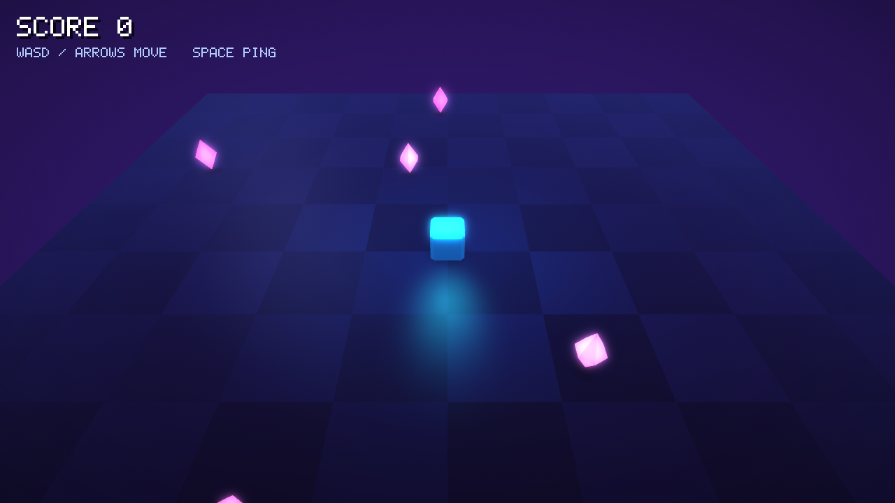
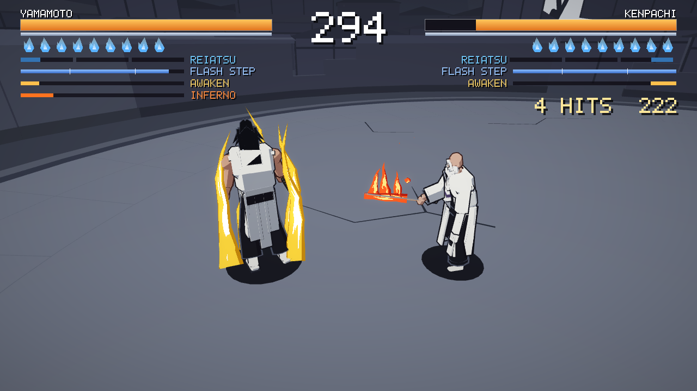
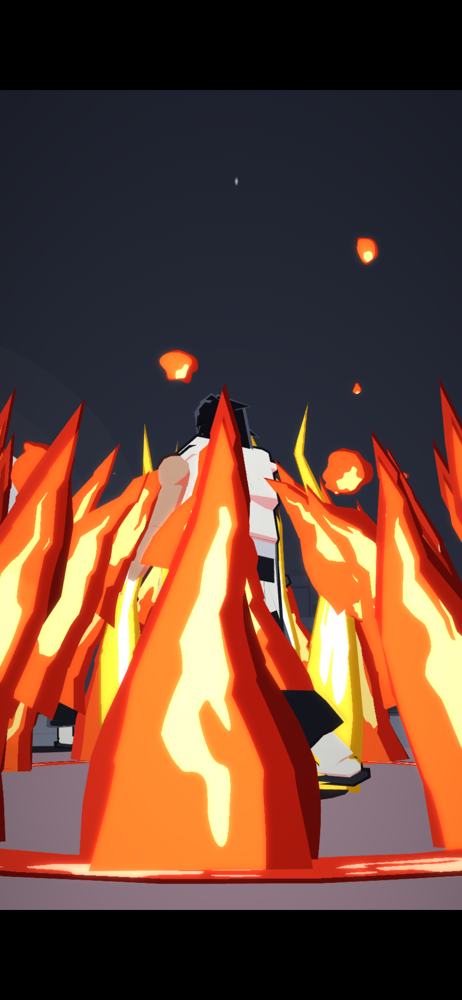

# 學習路徑：從 HELLO 讀到 RAVEN EDGE 與 SOUL DUEL

這份教材的對象是會一點程式、也許碰過一點 Lisp、想知道「網頁上的 3D 遊戲引擎和遊戲是怎麼做出來的」的人。它不從零教 Common Lisp，而是帶你照順序讀這個專案的真實程式碼。每一步都標了檔案和行號，建議把檔案開在旁邊對著看。

路線是這樣：先把最小的範例 `examples/hello` 建起來、跑起來、從頭讀到尾（第 0～2 步），再往下看引擎的四根柱子：幀迴圈與 GC、ECS、純函式規則、事件（第 3～6 步），接著是算圖（第 7 步），再用同樣的眼光讀完整的遊戲 RAVEN EDGE（第 8 步），最後看第二款、類型完全不同的遊戲 SOUL DUEL 教了哪些 RAVEN 沒教的事（第 9 步）。第 10 步是練習題。



---

## 第 0 步：準備、建置、執行

### 需要什麼

| 東西 | 用途 | 這台機器上的位置 |
|---|---|---|
| 32 位元的 host ECL 24.5.10 | 把 Lisp 編成 C | `/media/8tsp/projects/ecl-24.5.10/ecl-emscripten-host`（環境變數 `ECL_HOST` 可覆寫） |
| emsdk 4.0.12 | 把 C 編成 wasm | `/media/8tsp/projects/emsdk`（`EMSDK_DIR` 可覆寫） |
| `vendor/` | wasm 版 ECL、SDL3（WebGPU 後端）、Dawn 的 WebGPU C API | 已經在專案裡，不用自己建 |
| Node.js ≥ 22 | 無頭測試器 `tools/run.mjs` | |
| Google Chrome | 看遊戲、無頭測試 | 系統的 `google-chrome` |

換一台機器要從頭準備工具鏈的話，步驟寫在根目錄 [README.md](../README.md) 的「建置需求」。

### 建置和執行 hello

```sh
./build.sh examples/hello                    # 產生 dist/hello/{index.html,index.js,index.wasm}
python3 -m http.server -d dist/hello 8000    # 任何靜態伺服器都行
```

用 Chrome 開 `http://localhost:8000/`。直接雙擊 `index.html`（`file://`）不行，瀏覽器不允許這樣載入 wasm。

畫面需要 WebGPU。Windows、macOS、ChromeOS 上的 Chrome／Edge 113 以上預設就有。Linux 要看顯示卡和驅動；如果頁面顯示 `WEBGPU UNAVAILABLE`，可以這樣啟動 Chrome 再試：

```sh
google-chrome --enable-unsafe-webgpu --enable-features=Vulkan
```

聲音要等你在頁面上點一下或按一個鍵才會出來，這是瀏覽器的自動播放限制。

### 不開瀏覽器也能跑：無頭測試器

```sh
node tools/run.mjs dist/hello --secs 10 --shot out.png
```

`tools/run.mjs` 不需要安裝任何套件。它起一個小 HTTP 伺服器，開無頭 Chrome（WebGPU 走 SwiftShader 軟體算圖），把頁面的 console 印到終端機，最後拍一張截圖。加 `--script steps.json` 可以在指定秒數按鍵，格式寫在檔頭。頁面丟出 JS 例外時結束碼是 1。上面那張截圖就是這樣拍的。

### 在主機上一秒跑完的測試

有幾個檔案是純 Common Lisp，不用建置、不用瀏覽器，直接用 host ECL 就能測：

```sh
E=/media/8tsp/projects/ecl-24.5.10/ecl-emscripten-host/bin/ecl
$E --norc --load tests/ecs-test.lisp          # ecs-test: ALL PASS
$E --norc --load tests/rules-test.lisp        # rules-test: ALL PASS
$E --norc --load engine/lisp/package.lisp --load engine/lisp/math.lisp --load tests/test-math.lisp   # test-math: OK
$E --norc --load tests/input-test.lisp        # input-test: 31 checks, ALL PASS
$E --norc --load tests/cine-test.lisp         # cine-test: 18 checks, ALL PASS
$E --norc --load tests/duel-rules-test.lisp   # duel-rules-test: 1727 checks, ALL PASS
$E --norc --load tests/duel-control-test.lisp # duel-control-test: 53 checks, ALL PASS
```

這件事為什麼做得到，第 5 步會講。

---

## 第 1 步：專案地圖

```
engine/     可重複使用的引擎（ENGINE 套件）。不知道任何一款遊戲的存在。
  lisp/       Lisp 部分：數學、平台、算圖、模型產生、UI、音訊、動畫、時間、特效、ECS、app
  c/          C 部分：engine.h（Lisp 會呼叫的所有 C 函式）、main.c、render.c……
  shaders/    所有 WGSL 著色器
  web/        HTML 外殼 shell.html
game/       RAVEN EDGE（RAVEN 套件），用引擎做出來的完整遊戲
duel/       SOUL DUEL（DUEL 套件），第二款遊戲：1 對 1 格鬥（第 9 步）
examples/   只用引擎的小範例：hello（本教材）、engine-demo（算圖、模型產生、特效、UI 的展示）
tests/      主機上的測試、wasm 版的 demo、無頭測試腳本產生器、截圖
tools/      build.lisp（編譯腳本）、run.mjs（無頭測試器）、pkgcheck.sh、vendor 腳本
docs/       文件（索引在 docs/README.md）
```

引擎和遊戲的界線是套件：引擎的公開 API 就是 `engine/lisp/package.lisp` 第 8～93 行的 export 清單，遊戲用 `(defpackage :raven (:use :cl :engine))` 看到這些名字。引擎的程式碼裡沒有任何一行提到 RAVEN 或 SOUL DUEL。

### MANIFEST：一個建置目標的原始檔清單

每個建置目標是一個目錄，裡面有一個 `MANIFEST`。hello 的長這樣（`examples/hello/MANIFEST`）：

```
# title: HELLO
# The smallest complete game on the engine: ./build.sh examples/hello
# Walkthrough: docs/TUTORIAL.zh-TW.md, step 2.
hello.lisp
```

每一行是一個相對於該目錄的原始檔，`#` 開頭是註解，`# title:` 會變成網頁標題。`.lisp` 檔依序串起來編譯，`.c` 檔在連結時交給 emcc。引擎自己也有一份 `engine/MANIFEST`，`build.sh` 永遠把它排在最前面。遊戲的 `game/MANIFEST` 有 22 個 Lisp 檔和一個 C 檔，順序有意義：巨集、結構、元件要先定義才能用。

### build.sh：Lisp → C → wasm

```
engine/MANIFEST + examples/hello/MANIFEST
        │  .lisp 依序串成一個檔案
        ▼
build/hello/game-all.lisp
        │  32 位元 host ECL：compile-file，C 編譯器換成 emcc（tools/build.lisp）
        ▼
build/hello/libgame.a              ← Lisp 變成的 wasm 物件檔，初始化函式 init_game
        │  emcc：加上 .c 檔、vendor/ecl 的 libecl/GC/GMP、vendor/sdl3-webgpu 的 SDL3、Dawn 的 WebGPU port
        ▼
dist/hello/index.html  index.js  index.wasm
```

`build.sh` 只有 48 行，可以直接讀。讀的時候留意這幾件事：

- **ECL 把 Lisp 編成 C。** 這是 ECL 的特色：Lisp 函式會變成真的 C 函式，所以再交給 Emscripten 就能變成 wasm。host 版 ECL 必須是 32 位元，因為 wasm32 的指標和 fixnum 也是 32 位元，ECL 會把這類常數寫死進產生的 C。
- **為什麼整個專案只有一個編譯單元。** 一般的 ECL 專案會一個檔案一個檔案編譯，編 B 之前先把 A 載入，讓 A 的巨集在編 B 時看得到。這裡做不到：很多檔案用了 `ffi:c-inline`（直接嵌一段 C），host 上的 ECL 沒辦法執行它們，而編好的東西又是 wasm，host 也載不進去。所以 `tools/build.lisp` 第 26～37 行把所有檔案接成一個 `game-all.lisp`，一次編完。代價是改一行就全部重編（hello 約 6 秒，遊戲約 13 秒），而且編譯錯誤的行號要對照 `build/NAME/game-all.lisp`，每個原始檔開頭都有 `;;;; ---- engine/lisp/xxx.lisp` 這樣的標記方便找。
- **ECL 不會警告未定義的函式。** 遊戲如果用到引擎沒有 export 的函式名，會悄悄變成遊戲套件裡的另一個符號，編譯照樣成功，執行時才出錯。所以有 `tools/pkgcheck.sh`：

  ```sh
  tools/pkgcheck.sh examples/hello
  ```

  它印三行，三個數字都是 0 就是沒問題：`0 symbols that look like unexported ENGINE names`（用到引擎沒有 export 的名字，或剛好和引擎內部名稱撞名）、`0 top-level definitions that redefine an ENGINE export`（遊戲 `defun` 了一個和引擎 export 同名的函式，會悄悄蓋掉引擎的版本）、`0 functions called but defined nowhere`（打錯字或呼叫了已刪掉的函式）。有任何一項不是 0，結束碼就是 1。

---

## 第 2 步：從頭讀 examples/hello

`examples/hello/hello.lisp` 共 123 行，照順序讀。你控制一個發光的方塊，碰到寶石就得分，寶石會換個地方重生。

**第 6～7 行：自己的套件。** `(defpackage :hello (:use :cl :engine))`。引擎 export 的東西（`draw-mesh`、`defcomponent`……）可以直接用。

**第 11～14 行：一個音效。** `defsound` 定義「怎麼合成」這個聲音，本體回傳一段取樣資料。這個專案沒有任何音訊檔，所有聲音都是啟動時用程式合成的。`au-ping!` 在第 0 秒放一個 1320 Hz、快速衰減的音，60 毫秒後再疊一個高五度的音，聽起來就是「叮」。

**第 16～26 行：模型。** `build-mesh` 給你一個建構器 `mb`，在裡面呼叫 `mb-plane`、`mb-bevel-box`、`mb-cone` 這些基本形狀，最後上傳到 GPU。`with-xform` 在一段範圍內套用位移或旋轉：寶石是兩個錐體，一個朝上、一個用 `:roll pi` 翻過來朝下。`:jitter` 讓每個面的亮度隨機差一點，這是整個專案低面數畫風的來源。建模型會配置很多暫時的記憶體，所以只在啟動時做一次（第 3 步會說明為什麼啟動時可以、每幀不行）。

**第 28～34 行：三種元件。** 這是 ECS 的「C」。

```lisp
(defcomponent pos "Where it stands on the floor (metres)."
  (x 0.0 :type single-float) (z 0.0 :type single-float))
(defcomponent player "Moved by the keyboard." (speed 5.0 :type single-float))
(defcomponent gem "Collectable; spins." (angle 0.0 :type single-float) (value 10 :type fixnum))
```

`defcomponent` 和 `defstruct` 很像：它給你 `make-pos`、`pos-x` 這些函式，另外還有一個 `(pos e)`，傳回實體 `e` 身上的 `pos` 元件，沒有的話傳回 `nil`。

**第 36～42 行：生出實體。** 實體（entity）只是一個整數編號，本身沒有資料。它「是什麼」取決於掛了哪些元件：玩家是 `pos + player`，寶石是 `pos + gem`。`start` 在載入完成後執行一次，生出一個玩家和 8 顆寶石。`rnd-range` 是引擎的亂數（C 寫的 xorshift，不配置記憶體）。

**第 45～47 行：一條純規則。**

```lisp
(defun touching-p (ax az bx bz reach)
  (<= (+ (expt (- ax bx) 2) (expt (- az bz) 2)) (* reach reach)))
```

參數進、答案出，不讀全域變數、不改任何東西。這種函式最好測、最好理解。RAVEN EDGE 的戰鬥規則全都寫成這種形式（第 5 步）。

**第 51～73 行：系統。** 系統就是普通的函式，用 `do-entities` 拜訪「同時擁有某些元件」的每個實體：

```lisp
(do-entities (e pos player)          ; 每個有 pos 也有 player 的實體
  (setf (pos-x pos) ...))            ; pos、player 已經綁好該實體的元件
```

- `move-system`（55～61 行）：讀鍵盤（`key-down`、`key-pressed`），移動所有 `player`。按空白鍵播放低八度的「叮」。
- `spin-system`（63～65 行）：讓所有寶石轉。
- `pickup-system`（67～73 行）：兩層 `do-entities`，玩家對每顆寶石問規則 `touching-p`。碰到了就 `emit` 一個事件 `(:picked x z value)`，然後 `destroy-entity` 移除寶石。注意它**不**加分、**不**放音效。`(me pos)` 這種寫法是把元件綁到自己取的變數名，因為兩層都有 `pos`。

**第 76～87 行：處理事件。** `feedback-system` 用 `take-events` 取出這一幀累積的所有事件，一個一個處理：加分、放音效、在地上放一個擴散的圓環（`fx-ring`），再生一顆新寶石。「規則判斷、事件回報、另一個系統負責表現」這個分工是第 6 步的主題。

**第 90～103 行：畫圖。**

- 先設鏡頭（`camera-look-at`，跟著玩家），因為之後的特效要用鏡頭方向算。
- `draw-mesh` 把一個模型和一個 4×4 矩陣排進繪製佇列。矩陣用 `m4-euler!` 從位置和角度算出來，寫進同一個暫存矩陣 `*m*`；`draw-mesh` 會複製它，所以一個就夠。結尾是 `!` 的函式會把結果寫進第一個參數，不配置新記憶體。
- `add-point-light` 在玩家頭上放一盞青色點光源，`fx-decal` 在腳下畫一塊淡淡的影子。
- 寶石用 `:emissive 1.2` 自己發光，畫面後製的 bloom 會讓它暈開。

**第 105～108 行：UI。** `ui-text` 用引擎內建的 5×7 點陣字畫文字，`ui-scale` 依視窗高度給一個整數倍率。

**第 111～123 行：一幀，以及註冊遊戲。**

```lisp
(defun frame (dt)
  (move-system dt)
  (spin-system dt)
  (pickup-system)
  (feedback-system)
  (draw-system dt)
  (hud))

(run-game :title "HELLO"
          :load (list #'build-meshes)
          :start #'start
          :frame #'frame)
```

系統的呼叫順序就是設計：先移動，再判斷撿到，再表現，最後畫。`run-game` 告訴引擎三件事：啟動時要跑哪些載入步驟、載入完成後做什麼、每幀呼叫什麼。`dt` 是這一幀經過的真實秒數（最多 0.1）。

試著追一次「按住 D」：`move-system` 把玩家的 `pos-x` 加大 → `pickup-system` 發現碰到寶石，發出 `:picked` → `feedback-system` 加 10 分、叮一聲、放圓環 → `draw-system` 在新位置畫方塊，鏡頭跟過去 → `hud` 顯示 `SCORE 10`。

---

## 第 3 步：幀迴圈，以及為什麼 GC 只在幀與幀之間跑

`run-game` 只是把函式存起來（`engine/lisp/app.lisp` 第 23～25 行）。實際驅動迴圈的是 C 的 `engine/c/main.c`：

- `main`（第 74～86 行）：`cl_boot` 啟動 ECL，**立刻 `GC_disable()`**，載入編譯好的 Lisp（`ecl_init_module`），回收一次，然後把 `frame` 交給瀏覽器的 `emscripten_set_main_loop`，之後瀏覽器每畫一幀就呼叫它一次。
- `frame`（第 46～72 行）：啟動階段每幀呼叫一次 `ENGINE::%INIT-STEP`，每一步之後完整回收一次；啟動完成後每幀呼叫 `ENGINE::%FRAME`，回來之後如果這段時間配置超過 24 MB（第 17 行的 `GC_BUDGET`）就回收。

Lisp 這一側在 `app.lisp`：

- `run-init-step`（第 49～63 行）：啟動步驟依序是 `engine-init`（視窗、GPU、UI）→ 你的每個 `:load` 函式 → 開音訊裝置 → 每個 `defsound` 一步 → 你的 `:start`。一步一幀，所以頁面的載入條會動，瀏覽器也不會以為頁面當掉。
- `run-frame`（第 94～111 行）：`platform-poll`（讀輸入）→ `begin-frame`（清空佇列）→ 除錯指令 → 你的 `:frame` → `end-frame`（真的畫出來）。
- `%frame`（第 113～116 行）：一個 `handler-case` 包住整幀。沒處理的錯誤最後都在這裡被接住，顯示在頁面上，主迴圈停止（`%init-step` 對啟動步驟做一樣的事）。

```
瀏覽器的一幀                       瀏覽器的一幀
│ %FRAME ─ 你的 :frame ─ END-FRAME │ (GC) │ %FRAME ─ …
│ ← GC 關閉，Lisp 在執行 →         │ 堆疊上沒有 Lisp 物件：可以安全回收
```

### 為什麼要這樣

ECL 用的 Boehm GC 是「保守式」的：它掃描堆疊和暫存器，看到像指標的值就當成指標，藉此知道哪些物件還活著。在 wasm 上這個假設不成立：wasm 函式的區域變數不在記憶體裡，GC 看不到。如果 GC 在某個 Lisp 函式執行到一半時觸發，那個函式手上只存在區域變數裡的物件就可能被當成垃圾收走。

標準解法是用 Emscripten 的 ASYNCIFY 重建一切，但它會讓程式變大變慢，而且 ECL 的例外處理（setjmp/longjmp）和它合不來。這個專案選了另一條路：只在「確定沒有任何 Lisp 程式正在執行」的時候回收，也就是兩幀之間，`%FRAME` 已經回傳、堆疊空了的那一刻。

這帶來三條規則（完整版在 [ARCHITECTURE.md](ARCHITECTURE.md) 的 "The GC rule"）：

1. Lisp 裡永遠不要呼叫 `(ext:gc)`。
2. C 的全域變數如果存了 Lisp 物件，要用 `ecl_register_root` 登記（`main.c` 第 82～83 行就是例子）。更好的做法是 C 根本不存 Lisp 物件。
3. 每幀配置的記憶體要少。一幀之內配置的東西在這幀結束前都不會被收，而且每 24 MB 就要付一次幾毫秒的完整回收。

第 3 條是引擎很多寫法的原因：預先配置的矩陣、`!` 結尾的函式、`defun-fast`。想看自己每幀配置多少，在 hello 的 `start` 裡加一行 `(setf *stats-log* t)`，console 每 2 秒會印一行 `stats: fps … cons/frame … B …`。

對照一下啟動完成時的堆大小：hello 是 23.2 MB，RAVEN EDGE 是 87.1 MB，SOUL DUEL 是 103.1 MB（console 的 `startup: heap … MB`）。

---

## 第 4 步：ECS（Entity-Component-System）

打開 `engine/lisp/ecs.lisp`，155 行，開頭 1～26 行的註解就是整個設計。

**為什麼不用類別繼承。** 遊戲物件之間的差別在「帶了哪些資料」，不在「是哪一種類別」。主角、小兵、飛出去的苦無都有位置，只有戰鬥者有血量，只有苦無是飛行道具。用繼承會很快卡在「苦無要不要繼承角色」這種問題上。ECS 把三件事拆開：

| | 是什麼 | 在程式裡 |
|---|---|---|
| Entity 實體 | 一個編號，沒有資料 | 一個 fixnum，`spawn-entity` 傳回 |
| Component 元件 | 一包資料 | `defcomponent` 定義的 struct，每個實體每種最多一個 |
| System 系統 | 一段邏輯 | 普通函式，用 `do-entities` 找到需要的實體 |

**儲存方式。** 每一種元件有一個長度 256 的向量，用實體的「槽位」當索引（第 36～40 行）。所以 `(pos e)` 就是兩次陣列讀取。`do-entities`（第 123～140 行）展開後是一個掃過所有使用中槽位的迴圈，只要有一種元件是 `nil` 就跳過。

**編號與世代（第 58～69 行）。** 實體被刪掉後，槽位會給新的實體重用。如果編號只是槽位，別人手上留著的舊編號就會指到新實體，這是很難抓的 bug。所以編號 = 槽位 + 256 × 世代：`destroy-entity`（第 107～116 行）把該槽位的世代加一，舊編號的世代對不上，`entity-alive-p` 傳回 `nil`，所有元件 getter 也傳回 `nil`。因此實體之間可以放心互相記編號，例如 RAVEN 的飛行道具記著丟它的人（`projectile-owner`），丟的人死掉也不會出事。

**`defcomponent` 做了什麼（第 72～84 行）。** 一個 `defstruct`，加上一個 inline 的 getter `(name e)`。每種元件在編譯時拿到一個固定的儲存索引，直接寫死在 getter 裡。

**限制。** 最多 256 個實體、64 種元件，世界是全域的（一個程式一個）。對一個場上十幾個角色的動作遊戲來說夠用。

**測試。** `tests/ecs-test.lisp` 在主機上檢查了生成、查詢順序、移除元件、世代、事件佇列。`ecs.lisp` 是純 Common Lisp，所以可以這樣測。

**RAVEN EDGE 的元件。** `game/lisp/components.lisp` 第 1～18 行列出每種實體由哪些元件組成：

```
REN            transform motion model health fighter blade-trail player
an enemy       transform motion model health fighter blade-trail brain
a dummy        the enemy set + dummy
a projectile   transform projectile
```

粒子、雨、碎片、刀光的頂點**不是**實體。它們有好幾千個，每個只有幾個 float，放在引擎的大 float 陣列裡（`engine/lisp/fx.lisp`、`game/c/world.c`），每個幾乎零成本。實體留給「遊戲物件」。

---

## 第 5 步：函數式核心、命令式外殼

打開 `game/lisp/rules.lisp`。檔頭 1～7 行說明了規矩：這個檔案裡的函式只看參數、只回傳結果，不碰元件、不讀特殊變數、沒有副作用，連亂數都是從參數傳進來的一個數字。這叫「函數式核心」。

最好的例子是 `enemy-hit-outcome`（第 57～103 行）：一下攻擊打到敵人會怎樣？輸入全部是關鍵字參數：是不是 Raven 型態、是不是頭目、在不在防禦、在不在紅色蓄力、剩多少韌性和血量……輸出是一個小結構 `enemy-hit`（第 45～55 行）：結果（`:hit`、`:blocked`、`:killed`、`:crippled`……）、扣多少血、停頓幾幀。它不知道實體是什麼，也不知道畫面長什麼樣子。

「命令式外殼」是呼叫它的地方：`game/lisp/combat.lisp` 的 `enemy-take-hit`（第 192～247 行）。它從元件收集輸入、呼叫規則、再把結果套回元件（扣血、改狀態、擊退），最後發事件。

### 為什麼這樣切

**因為規則可以一秒測完。** `rules.lisp` 是純 Common Lisp，`tests/rules-test.lisp` 直接在主機上載入它：

```lisp
(let ((r (grunt l1)))                                 ; poise 10 - 10 breaks: a flinch
  (check (and (eq (eh-result r) :hit) (eq (eh-react r) :flinch) (~= (eh-hp r) 50) ...)))
```

不用建置、不用開瀏覽器、不用在遊戲裡等敵人出招。改完一條規則，0.04 秒就知道有沒有打破別的東西。遊戲裡要驗證同一件事，得建置、開無頭 Chrome、下除錯指令、翻 log。

**因為規則集中在一個檔案，讀得懂。** 想知道「格擋視窗是幾幀」「紅色攻擊能不能擋」，看 `player-hit-outcome`（第 122～153 行）就好，不用在 800 行的玩家狀態機裡找。

### 那為什麼外殼還是直接改資料？

純函式式的做法是每一步都產生新的元件，不改舊的。這裡刻意沒有這樣做，原因在 ECL：

- **浮點數會裝箱。** ECL 裡的 `single-float` 只要存進「一般的地方」（串列、沒宣告型別的欄位、一般變數），就會被包成一個堆上的物件，約 16 位元組。一個角色每步要更新十幾個 float，每秒 60 步，十幾個角色，全部複製一份的話每秒會多出幾 MB 的垃圾。
- **垃圾就是卡頓。** 第 3 步說過，GC 只能在幀之間做完整回收，垃圾越多，回收越頻繁。

所以取捨是：**決定**用純函式（好測、好讀、只在事件發生時跑，例如命中時），**狀態**留在元件裡原地修改。規則回傳的小結構也會配置記憶體，但一秒只有幾次命中，可以接受。攻擊判定期間每一步都要跑的 `vol-hit-p` 則寫成只收 float、只回傳真假值，本體用 `(safety 0)` 編譯，裡面不配置記憶體（不過照 ECL 的規矩，呼叫時傳進去的 float 還是會各裝箱一次）。它原本在 RAVEN 的 `rules.lisp`，SOUL DUEL 也需要一模一樣的東西，所以後來搬進了引擎的 `engine/lisp/hitvol.lisp`（第 29～64 行），同樣是純 Common Lisp，兩款遊戲的主機測試都直接載入它。

這次重構在同樣的自動遊玩測試下，每秒配置量大約多了 10%（見 [DEVLOG](DEVLOG.zh-TW.md) 第 13 節）。

---

## 第 6 步：事件和 feedback 系統

事件佇列在 `ecs.lisp` 第 142～155 行，只有兩個函式：`(emit kind data…)` 把一個串列推進佇列，`(take-events)` 依發生順序全部取出並清空。

RAVEN EDGE 的戰鬥程式碼從不直接放音效或特效。`combat.lisp` 的 `emit-hit`（第 99～102 行）只記下「誰打到誰、在哪裡、是不是重擊、要停頓幾幀」：

```lisp
(emit :hit att tgt (aref p 0) (aref p 1) (aref p 2) (fwd-x yaw) (fwd-z yaw) heavy hitstop ender)
```

`game/lisp/feedback.lisp` 的檔頭（第 1～18 行）列出所有事件的格式，`feedback-system`（第 21～61 行）把它們變成血霧、火花、音效、鏡頭震動、命中停頓、慢動作，順便累計連擊數和擊殺數。

它在 `game/lisp/main.lisp` 被呼叫兩次：每個模擬步長的最後（第 21 行），以及每幀一次（第 63 行，處理遊戲流程和除錯指令發的事件）。

好處：

- **規則和表現分開。** 要調「打擊感」（停頓多久、震多大、聲音多響），只要改 `feedback.lisp`，不會動到判定。
- **同一件事只表現一次。** 命中不管是從近戰、飛行道具還是投技來的，都走同一個 `:hit` 分支（`show-hit`，第 63～70 行）。
- **時序不變。** hitstop 和慢動作在步長結尾設定，從下一步開始生效（`engine/lisp/time.lisp` 的 `time-step`），跟規則自己設定的效果一樣。

hello 的 `:picked` 事件是同一個模式的最小版。

---

## 第 7 步：算圖

### 模型

`build-mesh`（`engine/lisp/meshgen.lisp`）在 CPU 上產生三角形，每個頂點 9 個 float：位置、法線、顏色。`make-mesh`（`engine/lisp/render.lisp` 第 56～62 行）呼叫 C 的 `r_mesh_new`（`engine/c/render.c` 第 131～145 行），把資料上傳進 GPU 頂點緩衝（每塊 4 MB，滿了就開新的一塊；`R_CHUNK`）。模型建好就不再改，也不會釋放，所以只能在啟動時建。

### 繪製佇列

`draw-mesh`（`render.lisp` 第 234～265 行）不會馬上畫，只是在陣列 `*dq*` 後面寫一筆 28 個 float 的紀錄：矩陣、色調、自發光、閃白、鏡面強度、模型編號、邊緣光。這個格式和 WGSL 裡的 `struct Draw`（`engine/shaders/lit-io.wgsl` 第 4 行）一模一樣。

一幀結束時，`end-frame`（`render.lisp` 第 361 行起）用**一個** `ffi:c-inline` 呼叫把整個佇列、特效頂點、UI 頂點交給 C 的 `r_frame`（`render.c` 第 211 行起）。C 把佇列當成一個 storage buffer 上傳，每次繪製只帶一個索引，頂點著色器用 `draws[instance_index]` 讀自己的那筆資料。這樣比每次繪製都推一次 uniform 快：錄 258 次繪製，CPU 時間從 0.33 ms 降到 0.10 ms。

`r_frame` 的一幀：

```
copy pass    上傳 繪製紀錄 · 特效頂點 · UI 頂點
scene pass   4x MSAA：天空 → 不透明模型 → 半透明模型 → 特效（alpha）→ 特效（加法）
bloom        取亮部 → 模糊 ×4（1/2、1/4 解析度）
swapchain    合成（場景 + bloom + 暈影）→ UI
```

### WGSL 著色器與 `// #include`

所有著色器都是 `engine/shaders/` 下的檔案。`render.lisp` 第 11～39 行的 `wgsl` 巨集在**編譯時**讀檔：`// #include "frame.wgsl"` 這一行會被換成那個檔案的內容，註解和空行被拿掉，結果變成一個字串常數編進 wasm。所以改了著色器要重新建置。

幾個你一定會撞到的規矩（細節在 [ARCHITECTURE.md](ARCHITECTURE.md) 的 Gotchas）：

- WGSL 不能寫在 C 字串或 `ffi:c-inline` 裡，因為 ECL 會把 `@` 當成自己的語法，`@group` 會被改壞。這正是著色器獨立成檔案的原因。
- SDL 的 WebGPU 後端是掃描著色器原始碼來推算綁定的，所以變數名稱不要含有 `sampler`、`read`、`write`。

### C 這一側

Lisp 呼叫的每個 C 函式都宣告在 `engine/c/engine.h`，在 `engine/lisp/platform.lisp` 第 5 行用 `ffi:clines` 引入一次，整個編譯單元都看得到。呼叫方式是一行 `ffi:c-inline`，例如：

```lisp
(ffi:c-inline (data n) (t :int) :int "r_mesh_new(#0->vector.self.sf,#1)" :one-liner t)
```

`#0`、`#1` 是參數，`->vector.self.sf` 是 float 陣列在 C 裡的指標。`#` 後面只讀一個字元，而且是 36 進位：第 11 個以後的參數寫成 `#a`、`#b`……；寫 `#10` 會被當成 `#1` 後面接一個 `0`。C 端只在這一次呼叫期間使用這個指標，不會留著（第 3 步的 GC 規則）。

---

## 第 8 步：RAVEN EDGE 是怎麼組起來的

有了前面的概念，打開 `game/lisp/main.lisp`（91 行），整個遊戲的一幀都在這裡。

`game-frame`（第 53～70 行）：輸入 → 遊戲流程 → 模擬 → 鏡頭 → 畫場景 → HUD，和 hello 的 `frame` 是同一個形狀，只是多了一層：

**固定步長。** 動作遊戲的招式數據以 1/60 秒的「幀」為單位（「第 15 幀開始有判定」）。為了讓這句話在任何幀率下都成立，`accumulate-and-step`（第 24～27 行）呼叫引擎的 `run-fixed-steps`（`engine/lisp/time.lisp` 第 64～75 行）：把真實時間累積起來，每滿 1/60 秒跑一次 `sim-step`，每幀最多 6 次，積壓更多就丟掉。這個累加器原本寫在 RAVEN 裡，SOUL DUEL 需要同一套，所以搬進了引擎。

`sim-step`（第 10～22 行）就是系統清單，順序即設計：

```lisp
(player-system kp)          ; REN：輸入緩衝 → 狀態機 → 物理 → 姿勢
(enemy-system ke)           ; 每個敵人：AI → 招式 → 物理 → 姿勢
(projectile-system ke)      ; 苦無、爆裂苦無、刀氣
(separation-system)         ; 把重疊的身體推開
(token-system (* ke +step+)); 攻擊權杖計時
(feedback-system)           ; 這一步的事件 → 聲音、血、震動、停頓
```

`time-step` 在命中停頓期間傳回 `nil`，整步跳過（模擬凍結，但粒子、雨、鏡頭照常動）。`kp`、`ke` 是慢動作倍率，玩家和敵人可以不一樣（Just Dodge 時只有敵人變慢）。

### 一下攻擊的旅程

用小兵 RAINBLADE 的突刺打中 REN 當例子，從資料一路走到音效：

```
資料        moves.lisp 125-126   (defmove :rb-lunge (... :s 30 :a 15 :r 42 ...)
                                   (30 45 :dmg 18 :cap (0 1.6 1.1 0.5) :react :stagger ...))
             └ register-move / parse-hit（29、20 行）→ MOVE 與 HITDEF 結構（rules.lisp 13-39）
AI 出招     enemy.lisp 291       (enemy-attack e :rb-lunge ...) → start-move（combat.lisp 10）
每一步      enemy-system → enemy-tick → enemy-step（combat.lisp 333）
             └ move-tick（23）→ move-hit-scan（64）→ hitdef-scan（42）
判定（規則） vol-hit-p（engine/lisp/hitvol.lisp 29）：膠囊碰到 REN 的受擊圓柱了嗎？
套用        resolve-hit（combat.lisp 72）→ player-take-hit（player.lisp 642）
結果（規則） player-hit-outcome（rules.lisp 122）：閃掉？格擋？彈反？受傷？
事件        (emit :player-hurt x y z fx fz heavy hitstop)
表現        feedback-system（feedback.lisp 21）：血霧、閃白、停頓、震動、紅色暈影、音效
```

反方向（REN 打中敵人）走的是 `enemy-take-hit` → `enemy-hit-outcome` → `emit-hit` → `:hit` → `show-hit`，結構完全對稱。

除了「判定」和「結果」兩格，其餘步驟都只是在搬資料。遊戲規則集中在 `rules.lisp`，數值集中在 `game/lisp/tuning.lisp`（跑速、彈反視窗、權杖數量）和 `moves.lisp`（每一招的幀數據），角色外觀和屬性在 `bodies.lisp`，動畫在 `clips.lisp`，音效在 `sounds.lisp`。這些「資料檔」大多是宣告式的巨集呼叫，改它們不需要懂系統怎麼運作。

各檔案的分工表在 [ARCHITECTURE.md](ARCHITECTURE.md)，玩法系統的細節和除錯指令在 [GAMEPLAY.md](GAMEPLAY.md)。

---

## 第 9 步：第二款遊戲：SOUL DUEL

RAVEN EDGE 是「一個玩家對一群敵人」。第二款遊戲 SOUL DUEL（`duel/`，DUEL 套件）刻意選了完全不同的類型：1 對 1 的 3D 競技場格鬥，參考《BLEACH: Rebirth of Souls》，角色是山本元柳齋、更木劍八，以及 2026-09-28 加入的朽木露琪亞（[DUEL_RUKIA.md](DUEL_RUKIA.md)），兩邊都可以是人或電腦。這是一份非商業的同人練習作品，角色名稱應使用者要求使用，模型、動作、音效全部由程式產生。



```sh
./build.sh duel                              # 產生 dist/duel/
python3 -m http.server -d dist/duel 8000
```

操作、除錯指令和測試在 [DUEL_GAMEPLAY.md](DUEL_GAMEPLAY.md)，規則和全部招式表在 [DUEL_DESIGN.md](DUEL_DESIGN.md)。（一個常被問的規則：U 在大多數型態是防禦，有兩個例外。山本卍解（2026-09-27 使用者決定的重製，[DUEL_YAMA_REWORK.md](DUEL_YAMA_REWORK.md)）分成『東・旭日刃』和『西・殘日獄衣』：在東按住 U（站立、走路、跑步時）就切到西，面板標 `U: WEST`；西的「獄衣」是全方位（360°）的防禦，擋下攻擊**沒有防禦硬直**，照樣能走、Step、出 L 和 SP1，面板標 `WARD`，但西的防禦量表完全不會回，量表歸零（GUARD CRUSH）或被破防招打中都會被打回東；在西出 L、SP1 以外的任何招式，出招的第一格就回到東。東的傷害是 1 倍加上「穿透」：k = 0.1～0.5（防禦量表越滿越高），打中時 ×(1+k)，被擋時有 k 倍傷害穿過防禦（跟削血一樣不會打死人），代價是受到的傷害 ×1.5。新的 L 技：東是突刺「旭光 KYOKKŌ」（穿透加倍，量表滿時被擋也有 85 全部穿透），西是以自己為中心的火柱環「焦熱地獄 SHŌNETSU JIGOKU」（打完還是西）；西的 SP1 反擊「極意返し」接住攻擊時防禦量表回滿。野晒三杯的 `U: DRINK` 則把一半傷害喝成 NOME。防禦中防禦量表不會回；而且所有角色的防禦量表回復速度在 2026-09-27 應使用者要求大幅調慢：每秒 12 → 5.5，破防後每秒 14 → 6.5。另一個常被問的：J／K 連段（2026-09-27 使用者的決定，[DUEL_STRINGS.md](DUEL_STRINGS.md)）最多三段，每段 J（輕、快）或 K（重、慢、沒有霸體），J／K 最多只能切換一次，所以完整路線只有 JJJ、JJK、JKK、KKK、KKJ、KJJ 這六條；換過鍵之後再按原來的鍵會被吃掉。下一段在前一段的任何時候都能先按（記住，等碰到對手才出），揮空就停在那一刀並多吃硬直（J +8 格、K +12 格）。第三段打中之後才能按 O 收尾（跳過瞄準直接出刀，按住就衝上去接 Kikon）；單發、SP、Breaker 都不能再取消成 O。自己的近戰碰到對手（打中或被擋）還會拿到「攻勢」KŌSEI：靈壓和瞬步，自己的防禦量表越少拿越多，最多 3 倍。）這一步不重講前面教過的東西（ECS、純函式規則、事件），只看 RAVEN 沒教、而格鬥遊戲逼著你面對的五件事，最後追一次 Kikon（鬼魂技）從按住按鍵、突進、砍中到魂魄碎掉的完整路徑。

`duel/MANIFEST` 的順序也分了層：`tuning`、`rules`、`control`、`kit` 是純 Common Lisp（主機上可測）；`yama*`、`ken*`、`rukia*` 是三個角色（資料、掛鉤函式、過場）；`fighter` 到 `main` 是通用的系統，其中規則、操作和各個系統（`rules`、`control`、`fighter`、`combat`、`hazards`、`ai`、`camera`、`flow`）**不准出現任何角色的名字**（只有除錯工具 `debug.lisp` 會指名角色來擺場景）。

### 9.1 一個虛擬手把，給人、電腦和測試共用

RAVEN 的玩家程式直接讀鍵盤。格鬥遊戲有兩個玩家，其中任一個可能是電腦，測試腳本還要能「按鍵」。如果每一種來源都有自己的一條路，電腦就可能作弊（直接改狀態），測試也不等於真人在玩。

解法是**虛擬手把（vpad）**，在引擎的 `engine/lisp/input.lisp`：戰鬥程式碼只讀 vpad，鍵盤、手把、電腦大腦、測試腳本都用同一種方式寫它，每個固定步長寫一次。

- `make-vpad`（第 39～45 行）：一組按鈕名稱、一個修飾鍵、緩衝幾步。
- `vpad-set!`（第 57～71 行）：這一步某個按鈕是不是按著。按下的那一刻會蓋上時間戳（`vpad-tick`），並記下當時修飾鍵有沒有按著。
- `vpad-pressed`（第 102～105 行）：時間戳還在緩衝期內（SOUL DUEL 是 10 步）而且沒被用掉，就算「按過」。這就是輸入緩衝。
- `vpad-command-pressed-p`（第 121～124 行）：指令表的一列（按鈕＋要不要修飾鍵）有沒有被按。
- `vpad-read!`（第 143～153 行）：裝置讀取器。按鍵對應是資料（一個 plist），它問遊戲給的 `down-p` 函式「這個鍵按著嗎」，自己完全不碰裝置，所以整個檔案是純 Common Lisp，`tests/input-test.lisp` 在主機上測它。

SOUL DUEL 這邊只有資料：`duel/lisp/control.lisp` 的 `*vpad-actions*`（第 12～15 行，九顆按鈕）、`new-vpad`（第 17～19 行）、指令表 `*commands*`（第 22～34 行，優先順序由高到低）、`*p1-bindings*`（第 46～55 行）和 `*p2-bindings*`。

誰來寫？真人：`pilot-system`（`duel/lisp/ai.lisp` 第 452～455 行）在每一步呼叫 `vpad-begin-step!`，它執行 vpad 的讀取器 `p1-reader`（`duel/lisp/fighter.lisp` 第 26～28 行）。電腦：`brain-step`（`ai.lisp` 第 403～446 行）想好要按什麼，最後一樣用 `vpad-set!` 把每顆按鈕寫進去（第 440 行）。`spawn-fighter`（`fighter.lisp` 第 31～48 行）裡，「人或電腦」只差在 vpad 有沒有讀取器、實體有沒有 `brain` 元件。

好處：電腦只能做人做得到的事；`tests/duel-control-test.lisp` 可以檢查「經過按鍵對應讀進來」和「直接注入」結果完全一樣；而且因為輸入是在固定步長裡讀的，同一串按鍵每次都得到同一場比賽（9.5）。

### 9.2 角色是資料加掛鉤

`duel/lisp/kit.lisp` 定義兩個宣告式的巨集：`defmove`（第 140～178 行，一招一個 plist）和 `defkit`（第 319～371 行，角色的一種型態一個 plist）。通用的戰鬥程式碼只讀它們產生的結構。

看山本的招牌技（`duel/lisp/yama.lisp` 第 32～38 行）：幀數、傷害、判定範圍都是數字，只有一件事資料做不到，就是「第 40 幀放出一道火焰波」，所以寫成 `:on-frame ((40 yama-fire-wave))`。`yama-fire-wave`（第 199～208 行）是普通函式，通用的 `main-phase-step`（`fighter.lisp` 第 427～445 行）在那一幀用 `funcall` 呼叫它（第 437 行）。為什麼寫符號而不是 `#'yama-fire-wave`？整個遊戲是一個編譯單元，招式資料在載入時就執行，那時後面的 `defun` 還沒定義，`#'` 會失敗；符號到真的要呼叫時才去找函式。

型態也是資料。劍八的野晒分成三杯（「呑め」量表的三階，`duel/lisp/ken.lisp` 第 160～211 行）：一杯片手只寫了「繼承 `:base`、起手 +2 幀、距離 ×1.3、換掉 SP1 和 Kikon」；二杯兩手繼承一杯，另外寫了自己的一整組劍道連段（`:grid`）和 +3 幀、×1.4；三杯繼承二杯、完全不推導，直接沿用二杯的招式，只把 K1 換成空間斬。其餘十幾招由 `register-kit`（`kit.lisp` 第 265～317 行）在載入時從原招式重新推導（第 305～312 行；不推導的型態拿上一型態的版本），沒有任何一招是複製貼上的。連段本身也是資料：`:grid` 列出六個動作加兩個「換過鍵的第二段」（`defmove-copy` 複製出來、只換名字），`string-grid` 展開成十條連線，「J／K 只能換一次」就寫在這十條線裡。數值可以直接寫 `tuning.lisp` 的變數名（例如 `:walk *walk-kenpachi*`），`resolve-tuning`（第 18～22 行）在載入時換成值。

三杯之後還有第二次覺醒：**劍八的卍解**（`duel/lisp/ken.lisp` 第 215～250 行，設計與使用者的決定在 [DUEL_KEN_BANKAI.md](DUEL_KEN_BANKAI.md)）。這是「一場只能覺醒一次」唯一的例外（使用者 2026-09-27 的決定）：三杯（NOMIHOSE）、自己剩下的魂魄**四個以下**、自由狀態下按 P 就進入 `:bankai`（2026-09-28 使用者改的：原本要紅血，現在改成「剩餘四魂以下」，`*bankai-konpaku*`）。代價是使用者 2026-09-28 定的：**劍八自己的魂魄直接變成 1，HP 回滿**，之後被 Kikon 或 Soul Break 一次就輸。「能不能開」也是資料：只有三杯的 kit 寫了 `:bankai-form :bankai`，卍解和之後的片腕都沒有，所以結構上一場只有一次；判斷寫成純函式 `bankai-allowed-p`（`rules.lisp`）。卍解的量表「腕」有 4 格，放在原本 NOME 的 kit 量表裡：L、SP1、SP2、I 和一般的 O 每出一招扣一格並自損 60 靈子（`kit-pip-cmd-p`、`pip-spend`）；J／K 連段則是**一整套只扣一格**（使用者 2026-09-28 試玩後的決定：原本每個 K 都扣，K 太貴），不管打完、被打斷還是揮空，都在這套連段結束的那一刻才扣（`gauges-arm-owed` 記著「這套還欠一格」，純函式 `string-pip-due-p` 判斷何時結帳），只有 J 的 JJJ 不扣；K 還是要有一格才能出，連段中途想用 SP／L 取消則要多留一格。5 秒沒扣格就自己裂一格（`pip-step`），扣光以後等這一招打完，手臂爆裂（`burst-due-p`、`combat.lisp` 的 `arm-burst!`），之後整場都是 `:kataude`（片腕：基本型的招式距離 ×0.7，由 `:reach-mult` 推導出來）。卍解的招式大多沿用舊動畫、只換數字；新的是三個片段（站姿、拳、咬）、一把斷刀、一個身體變體（`body-variant`：同一副骨架換調色盤、加角和手臂裂痕）和兩段過場。2026-09-28 使用者要「更野性」：站姿改成壓低前傾的野獸蹲姿（頭低、駝背、手臂鬆垮張開、斷刀拖在身後），走路、跑步、防禦也都換成這個鬼的樣子；共用的走路和防禦片段是用身體變體的 `:clips` 對照表換掉的（`play-clip` 查 `body-clips`），所以通用檔案仍然不帶角色名字。這些只改畫面，招式的幀數、距離、判定都沒變。這些全部都在角色檔裡，通用檔案只多了幾個不帶名字的 kit 鍵（`:bankai-form`、`:pips`）和一個招式旗標 `:rend`（霸體與架式擋不住）。

這條規矩有檢查：`grep -nE ':ya-|:ke-|:ru-|yama|kenpachi|rukia' duel/lisp/{rules,control,fighter,combat,hazards,ai,camera,flow}.lisp` 必須什麼都印不出來，`tests/duel-rules-test.lisp` 最後也有同樣的檢查。所以加一個「用現有機制就能描述」的角色不必改任何通用檔案（練習 8）。

第三個真正的角色**朽木露琪亞**（`duel/lisp/rukia.lisp`、`rukia-art.lisp`）示範了另一半：她帶來前兩個角色沒有的機制，這時通用檔案要改，但只加**不帶名字的鍵**，行為仍寫在她的資料裡。她的覺醒「絕對零度」是一條**冷度量表**（2026-09-28 試玩後重做）：冷度 0～200，畫成疊在一起的兩條（`:meter (:temp t :max 200)`）。防禦時每秒冷 90（一條 1.1 秒），沒防禦時回溫（每個溫度帶自己的 `:warm`：−18 每秒 10、−50 每秒 12、絕對零度最慢，每秒 5），被擋下的近戰讓她更冷、真的被打中讓她回溫。第一條滿就降到 −50 °C（`:m50`），兩條都滿是絕對零度（`:zero`）；第一條空了回 −18，第二條空了回 −50。「冷度在哪一帶就是哪個型態」寫成純函式 `temp-band`，每幀的變化是 `temp-next`（`rules.lisp`，主機上測）。出招花冷度是 kit 鍵 `:cold`（−18 只有 L 要花、不夠就不能出），「越冷越慢、對手越難離開她身邊」是 `:field`（寒域：只把對手「遠離她」的那一部分速度打折，純函式 `field-velocity`、`field-step`），「零度被破防就碎裂」是 `:crush-hook`，「不能閃步」是 `:rooted`（連招式的前衝和連段追身都關掉），「每回合重置回 −18」是 `:reset-form`，量表旁的「U: COOL」是 `:u-tag`。零度的防禦沿用山本西的 `:ward` 被動，另加三個被動：`:optic`（遠程和場上的危險物穿過防禦，`optic-p`）、`:freeze-touch`（第一個被擋下的近戰把攻擊者凍住）、`:chipless`。新的狀態「霜」（走路和跑步 ×0.7）是招式的一個鍵 `:frost 60` 加上戰士身上的一個計時器。凍結柱是新的危險物種類 `:freeze`（和 `:bind` 一樣是圓盤，但劍八的「斬斷飛行道具」砍不掉它）。電腦也一樣：`:awaken (:melee-share 0.6 :min-taken 150)`（吃到的傷害六成以上來自近戰才覺醒）、`:cool`（按住 U 冷到下一帶）、`:brace`（零度時按住 U 撐住）都是 `ai.lisp` 看得懂的通用鍵。結果：山本與劍八三組對戰的參考紀錄一個位元都沒變。

**玩的時候看到什麼（露琪亞覺醒後）。** 量表列上只剩一條「凍」冷度量表：淺藍的是第一條，白色疊在上面的是第二條，左端三個小方塊亮幾個就是幾度（−18／−50／−273），右邊寫著目前的溫度。按住 U 防禦就會變冷；不防禦就慢慢回溫。第一條滿了變 −50，兩條都滿是 −273；回溫把上面那條用光，就退回上一帶。量表上顏色變暗的那一段是「現在按 L 會花掉的冷度」，不夠時那裡只剩一條白線，按了也出不來。越冷走得越慢，但每一招都打得更遠、更痛、動作也不一樣（L 從霜柱、氷震長到零度凍結，半徑 2.5 → 3.5 → 5.5 公尺），她身邊地上的白圈是「寒域」：對手在圈裡往外退會變慢、往後閃步會變短，往旁邊閃不受影響。−273 完全不能動，只能靠冰的距離和自動防禦；這時按住 U 是「撐住」：不會回溫，但防禦量表一直掉，掉光就碎裂（冷度歸零、自損、跪倒，2 秒內防禦不會降溫，量表變灰寫著 THAW）。手機單手模式時，拇指放著就是防禦，拇指圈外那道白弧就是冷度（一圈 = 兩條全滿）。**K 之後接 L**（2026-09-28 試玩後的決定，覺醒前後都可以）：K 連段的任何一下（K1、K2、K3）碰到對手時按 L，L 會像下一段一樣排進去，在那一下結束時接出來；打中的話對手還在硬直裡，就是一套連段（始解的月白換成出得比較快的版本，圓圈出現 10 幀後冰柱就冒出來；覺醒後就是那一帶自己的 L）。K 被擋下時 L 還是會出，但對手可以照常防禦。**連段裡溫度鎖住、可以透支**（同一天的決定）：從一套連段的第一下開始，到最後一個接上的動作（J／K 連段、K 接 L、O 收尾、SP 取消）打完為止，她一直用開始時那一帶的招式；這段期間 L 只要冷度還大於 0 就能出，不夠的部分透支，冷度最低到 0。連段結束後才按剩下的冷度重新決定溫度帶，可以一次掉好幾帶：冷度歸零就回 −18（連 −273 也是），−273 剩不到一條就回 −50。例如 −273 的 K K K（花 120，剩 80）再接 L（100）：L 照樣打出去，冷度歸零，放完回到 −18。連段以外，冷度不夠時 L 還是出不來。（這兩條規則是 `rules.lisp` 的純函式 `temp-band-at` 和 `cold-ok-p`，在主機上測。）這是通用的 kit 鍵 `:l-after-k`（`kit.lisp` 的 `kit-l-link`，閂鎖在 `fighter.lisp` 的 `move-commands`），寫法見 [DUEL_STRINGS.md](DUEL_STRINGS.md) §12。

### 9.3 同時結算的命中

兩個角色在同一步互砍，誰先算？如果照實體順序，P1 永遠先結算：他的攻擊先把 P2 打進硬直，P2 的攻擊就「沒發生」。這種偏差在一對多的 RAVEN 看不出來，在 1 對 1 裡是作弊。

SOUL DUEL 分兩段：

- `fighter-system`（`fighter.lisp` 第 698～721 行）先把每個人「對手現在站哪」記下來（`fighter-ox`、`fighter-oz`），再讓兩個人各走一步，所以誰都看不到對方這一步的移動。一方對另一方造成的凍結、鎖輸入，等兩個人都走完才生效（第 680～684 行；Burst Reverse 也是這時才生效，第 685～690 行，而且在這一步的命中結算之前，所以 Kikon 突進還沒砍中時被 Burst，突進就中斷了，不管誰先走）。
- `hit-system`（`duel/lisp/combat.lisp` 第 307～330 行）先檢查 Breaker 互撞，然後**收集**所有碰到的近戰與飛行道具命中（`collect-melee`，第 258～278 行），每一筆連同攻擊者當下的招式、蓄積的傷害、防守方當時紅不紅一起存進 `pending`（第 249～254 行），最後才一筆筆**套用**（`apply-hit`，第 101～246 行）。這一步確認的 Kikon 和靈子歸零的 Soul Break 在最後一起結算（`settle-souls`，第 488～511 行）：互砍到兩邊同時沒命就是平手。

程式碼審查時抓到的真實 bug 就是這個：`pending` 原本沒存攻擊者的招式，套用時才去讀，而第一筆命中已經把對方打進硬直、招式清空了，所以每次互砍 P2 的那一刀都少了屬性。修好之後，除錯指令 2319 讓兩個山本在同一步出 J1，兩邊靈子剩下的一樣多。

### 9.4 過場導演：規則決定，過場只負責呈現

Kikon、覺醒、K.O. 都有最長約 2 秒的過場。過場很容易變成規則的一部分（「動畫播到第幾幀才扣命」），然後就不能跳過、不能快轉、測試也要等它。SOUL DUEL 的規矩是：**過場開始之前，結果已經算完了**。`settle-souls`（`combat.lisp` 第 488～511 行）先 `settle-konpaku` 扣掉魂魄、補滿靈子，最後才 `start-cine`，並把「接下來重置或結束比賽」交給 `:after`。所以就算過場被跳過（除錯指令 2100），也什麼都不會少。對戰中的覺醒、Kikon、Soul Break 過場，玩家不能跳過（2026-09-28 使用者的決定）：按 Esc／Start 只會暫停，點螢幕也沒反應；只有開場和 K.O. 過場還能跳過。

導演在引擎的 `engine/lisp/cine.lisp`。`defcine`（第 38～61 行）定義的腳本有兩種模式：

- `(at 幀 …)`：**步長模式**，每個固定步長跑一次：切鏡頭、換動作、播音效。這些是決定性的。
- `(during (起 迄) …)`：**繪製模式**，每個畫面幀跑一次：火焰、光暈、鏡頭推移這些只給人看的東西，`u` 從 0 走到 1。

`main.lisp` 的 `sim-step`（第 29～41 行）在過場中改跑 `cine-step`（第 32 行），角色、飛行道具、計時器都停住；`draw-scene`（第 331～348 行）每幀呼叫 `cine-draw`（第 338 行）。例子是山本的 Kikon（`yama.lisp` 第 339～363 行）：第 0 幀定格、第 12 幀黑底字幕卡，`during (12 186)` 每幀畫火焰圓頂，第 142 幀魂魄碎裂。

這背後是兩種時間：

- **模擬時間**：固定步長。命中停頓時凍結、慢動作時跳過、過場時角色不動。規則、AI、招式幀數都用它。
- **特效時間**：每幀的真實秒數。粒子、光暈、鏡頭平滑、`during` 裡的畫面都用它（`fx-update` 拿的是真實的 `rdt`，`main.lisp` 第 345 行）。

原則：模擬會讀到的東西一律用模擬時間，只用來看的東西才用真實時間。所以命中停頓在 SOUL DUEL 是規則，由 `apply-hit` 設定（`combat.lisp` 第 169 行 `(hitstop (hw-hs hw))`），而不是像 RAVEN 那樣在 feedback 系統裡設定（第 6 步）。

### 9.5 決定性：sim-rnd01 與 rnd01

引擎有兩條亂數流（`engine/lisp/package.lisp` 第 180～184 行）：`rnd01` 給裝飾用（粒子、震動、音高），每幀、每顆粒子都在抽，所以它的序列跟幀率有關；`sim-rnd01` 給模擬用，**只在固定步長裡抽**。SOUL DUEL 的電腦（`ai.lisp`）只用 `sim-rnd01`，特效（`vfx.lisp`）只用 `rnd01`，比賽開始時 `start-match` 用種子重設模擬那條（`duel/lisp/flow.lisp` 第 116 行）。

光是亂數分開還不夠。其他讓「同一個種子＝同一場比賽」成立的條件：

- 裝置在固定步長裡讀（9.1），不是每幀讀。
- 真人的搖桿方向透過「模擬擁有的視角方向」換算（`view-step`，`fighter.lisp` 第 132～144 行），而不是讀跟著真實時間平滑移動的攝影機。
- 慢動作用「跳步」實作（`main.lisp` 第 34～36 行）：每步累加倍率，滿 1 才跑一個模擬幀，所以幀數永遠是整數。這個累加器 `*slow-acc*` 在每場開始時歸零（`start-match` 呼叫 `reset-slow-clock`）：完美 Hoho 的慢動作會留下零頭（0.5、0.75……），以前它會帶進下一場，讓下一場第一次慢動作錯開一步，結果同一個種子在測試關卡裡的成績取決於前面跑過哪些比賽。
- 命中停頓由規則設定、過場在步長時鐘上跑（9.4）。
- `dir-yaw`（`rules.lisp` 第 20～24 行）用 Common Lisp 的 `atan`（倍精度），不用引擎的 `yaw-to`（單精度 `atan2f`）：兩者差最後一位，就會長出另一場比賽，而參考紀錄是用前者錄的。

驗證方法：每 600 步印一行 `duel hash`（`state-hash-line`，`duel/lisp/debug.lisp` 第 83～96 行，位置、朝向、每個量表、上一次 Kikon 突進值幾個魂魄、電腦的 heat）。`tests/scripts/duel-cvc-yk.json` 用種子 7 讓兩個電腦打完一場，最後一行一定是：

```
duel -> RESULTS winner P2 konpaku 0-6 ticks 5516 secs 91.9
```

（2026-09-29 劍八電腦在二、三杯變得更積極（只改 AI，[DUEL_NOZARASHI_V2.md](DUEL_NOZARASHI_V2.md)「The CPU after the faster drain」）之後，這一行和 KK 變了，YY 不變；之前（NOME 下降加快兩倍之後）是 `winner P1 konpaku 2-0 ticks 9636 secs 160.6`。）

（2026-09-28 加入露琪亞之後，這一行和 YY、KK 的 hash 行都沒變。hash 行只在她身上多印兩個欄位：`u<…>`（冷度量表的第二個數：碎裂之後還剩幾幀不能降溫）和 `fr<霜剩幾幀>`（被凍到的一方），她的冷度就是 `m<…>`；沒有這兩種狀態的行一個字都不變。同一天的冷度量表重做、劍八「一套連段扣一格」和山本「南」取消冷卻之後，這一行和 KK 仍然不變（種子 7 的兩場都沒有卍解的連段）；YY 的結果也一樣，只有 t=6600 那一行的冷卻欄位從 220 變成 0，因為南不再有冷卻。）

（2026-09-28 連段追身與劍八卍解改成「剩四魂以下」就能開之後，三組的 hash 行全部改變；在那之前這一行是 `winner P2 konpaku 0-3 ticks 7123 secs 118.7`。2026-09-28 Soul Break 新規則與劍八卍解之後，這一行和 YK、KK 的 hash 行都沒變，因為這兩場沒有 Soul Break、也沒有人開卍解；YY 從 t=4200 開始不同（Soul Break 改播毀魂技動畫，過場變長），結果變成 `winner P2 konpaku 0-4 ticks 6948 secs 115.8`。hash 行只有在有「腕」量表的型態才多印 `u<裂開倒數>` 和 `*`（爆裂待發），其他型態的行一個字都不變。2026-09-27 J／K 連段、O 收尾與攻勢之後的值，三組的 hash 行全部改變；之前是山本卍解重製與防禦量表回復變慢之後的 `winner P1 konpaku 2-0 ticks 7688 secs 128.1`，再之前是 `winner P2 konpaku 0-4 ticks 9305 secs 155.1`。2026-09-26 guard v3 之後的值：靈子 1100 → 1300（使用者的決定：真人對戰比電腦對電腦快得多）、防禦中防禦量表不回、卍解的防禦量表只靠打中對手補（Kikon 重置時沿用）、山本西的 U 改成「殘日獄衣」火焰防禦（擋下扣一半、每一下近戰都燙傷對手，遠程攻擊只受 0.6 倍傷害而且不會被打出硬直）、野晒二杯掉得比較慢、東的受傷倍率 1.4 → 1.2。同一天的追加修改（卍解防禦量表被削減 ×1.3、東打人回復量減半為 0.05、劈開隕石等招式「刀身近處算近戰、遠處的斬線才算遠程」）沒有改變這一行，但 YK 的 hash 行和 YY 的結果變了。上一版是 `winner P1 konpaku 7-0 ticks 7351 secs 122.5`（劍八那一批：山本西「按住 U = 霸體」、野晒的三杯「呑め」量表、跑步時面向對手），再之前是 `winner P2 konpaku 0-3 ticks 8594 secs 143.2`。規則一改，這一行就要跟著換，同時更新 DUEL_GAMEPLAY.md、`tests/scripts/duel.py` 的註解和 `tests/style-cvc-ref.txt`。）

跑兩次、把所有 `^duel` 開頭的行 diff 一下，應該完全相同（指令在 DUEL_GAMEPLAY.md）。這就變成一個不用寫的回歸測試：任何「不該改變行為」的修改（重構、把程式搬進引擎）都必須讓這一行和十三行 hash 一字不差。把 SOUL DUEL 的東西收回引擎時，每一步都是這樣檢查的。

### 9.6 一次 Kikon 的旅程

劍八的靈子已經掉到 30% 以下（變紅）。山本（始解）在 5 公尺外按下 O，而且一直按著。山本始解的 O 模組是「炎上」（`yama.lisp` 第 54～58 行的 `:ya-kikon`）：不衝刺，瞄準 6 幀後沿著一條 1～9 公尺的直線升起火牆：

```
按鍵        control.lisp 51           *p1-bindings* 裡 :kikon ((:key :o) (:pad :rt) (:touch :kikon))
讀進手把    ai.lisp 452-455            pilot-system → vpad-begin-step!（input.lisp 51-55）
                                        → p1-reader（fighter.lisp 26-28）→ vpad-read!（input.lisp 143-153）
                                        → vpad-set!（57-71）：Kikon 鈕按下，蓋上時間戳；之後每一步都是「按著」
這一步      main.lisp 29-41            sim-step → sim-systems → fighter-system（fighter.lisp 698-721）
                                        → fighter-step（678-696）→ neutral-step（338-367）
指令        fighter.lisp 306-312       command! 依 *commands* 的順序找到被按下的 :kikon
                                        → try-command（271-297）：模組的 90 幀冷卻開始 → start-move（169-193）：
                                        進入這一招，階段 :aura，頭上跳出 "KIKON"
突進        fighter.lisp 398-425       kikon-rush-step，每一步問規則 kikon-rush-next-phase（rules.lisp 174-182），
                                        數字來自招式的 :params：瞄準 6 幀，炎上沒有衝刺（:dash-max 0）
                                        → 直接出刀（enter-main，fighter.lisp 195-200）；第 4 幀火牆開始升起
收集        combat.lisp 307-330        hit-system → collect-melee（258-278）：第 20 幀火線碰到了，
                                        記下劍八這時紅不紅（red-p）
套用        combat.lisp 101-246        apply-hit：resolve-contact（rules.lisp 111-146）照常判定，
                                        他防禦就是 :blocked；這次沒防禦，是 :hit。
                                        第 140 行 kikon-outcome（rules.lisp 311-321）：砍中、而且「這一步」
                                        O 還按著 → :follow：劍八被擊退 2.5 公尺、踉蹌，照常吃 70 傷害，
                                        山本的招式進入 :follow 階段（第 175 行）
衝入        fighter.lisp 398-425       kikon-rush-step 的 :follow：山本追著劍八衝過去，速度由
                                        kikon-follow-speed（rules.lisp 339-342）算，剛好在 kikon-follow-wait
                                        （326-329）幀結束時到達出刀距離，然後再砍一次
第二刀      combat.lisp 101-246        這一刀是 follow：劍八紅了，kikon-follow-unguardable-p（rules.lisp 323-326）
                                        讓它不能防（他踉蹌的時間 kikon-follow-stun 也拖到這一刀之後）；
                                        kikon-outcome 回 :kikon（第 142 行），不扣靈子，排進 *kikons*
結算        combat.lisp 488-511        settle-souls → settle-konpaku（471-486）→ kikon-result（rules.lisp 346-355）：
                                        扣 2 個魂魄（覺醒中 3 個），靈子補滿，發出 (:konpaku 劍八 2)
表現        feedback.lisp 167          :konpaku → pips-shatter（hud.lisp 155-161）：HUD 上兩個魂魄碎掉
過場        cine.lisp 66-78            start-cine 突進招式的 :cine（'yama-kikon-cine），之後每一步 cine-step（96-106）
                                        yama.lisp 339-363：鏡頭、字幕、火焰圓頂，第 142 幀魂魄碎裂
結束        cinema.lisp 39-52          cine-end：恢復場景、忘掉過場中亂按的鍵（vpad-flush!）
            combat.lisp 513-532        :after → reset-round：兩人相隔 8 公尺、48 幀不能動、防禦量表補滿
                                        （每個人都一樣，卍解也是：2026-09-27 的重製拿掉了「沿用」）
                                        （魂魄打光的話改成 match-over，flow.lisp 136-143）
```

換幾個條件，路線在哪裡分岔：

- **O 在砍中之前就放開了**：`kikon-outcome` 回 NIL，`apply-hit` 走一般命中那條路，70 點傷害加擊退。這一刀如果剛好把靈子打到 0，就是一般的 Soul Break（`deal-damage` 排進 `*soul-breaks*`，同樣在 `settle-souls` 結算）。Soul Break 扣的是**攻擊方當下型態**的 Kikon 數 + 1，上限 5（只有 Soul Break 放寬到 5，Kikon 還是 4；使用者 2026-09-27 的決定），播的過場也是攻擊方當下型態的毀魂技動畫（`kit-kikon-cine`，`kit.lisp`：那個型態的 O 招的 `:cine`），所以山本始解打出的 Soul Break 會播「城郭炎上」、扣 3 個魂魄。
- **劍八防禦了第一刀**：不管紅不紅，都是 `:blocked`（−14，扣 20 防禦量表），`kikon-outcome` 回 NIL，什麼都不會接著發生。
- **劍八沒變紅，被砍中，O 還按著**：一樣擊退、山本一樣衝進來，但劍八只踉蹌 16 幀（`*kikon-follow-stun*`），第二刀在他能動之後 12 幀才到（`*kikon-follow-gap*`）：衝刺中按住防禦就擋下（`:blocked`，不扣魂魄），也可以閃步或 Hoho。沒擋住，第二刀的 `kikon-outcome` 看到 FOLLOW 就回 `:kikon`，之後同上。
- **劍八在閃步或 Hoho 的無敵幀裡**：`defender-state` 回 `:invuln`，`resolve-contact` 回 NIL，刀揮空，山本吃 30 幀的揮空硬直。
- **連段打完的 O 收尾**（第三段 J3／K3 打中之後、還在取消視窗內按 O）：路線從 `main-phase-step` → `move-commands`（`fighter.lisp` 第 463～495 行）的 `:kikon` 那一格開始，`skip-aura` 跳過瞄準直接出刀（炎上沒有衝刺，所以當場就砍），其餘一樣。只有第三段打中才行：第三段被擋、揮空、停在第二段，或單發、SP、Breaker，都不能再取消成 O（2026-09-27 使用者的決定）。
- **連段的第二、三段**（2026-09-28 使用者的決定：「只要普通攻擊擦到，攻擊方在接續的攻擊動畫中就會靠近對手」）：只要這一串裡**有任何一段碰到對手**（打中或被擋都算），之後按下的每一段都會打出來，就算中間某一段揮空也照樣接下去；只有第一段就揮空，才會停在那裡吃揮空硬直。接續的那一段在出招前搖（startup）裡會往對手靠近，剛好在判定出現時搆到他（`string-chase-speed`，`rules.lisp`；最快每秒 18 公尺 `*chase-max*`，停在招式距離內 0.4 公尺 `*chase-margin*`，不會穿過或衝過頭）。這只是「動作」：對手照樣可以防禦，閃步、Hoho、倒地的無敵幀照樣躲得掉。

注意「按著」是在**砍中的那一步**讀的：`vpad-down` 讀的是這一步 `pilot-system` 寫進 vpad 的狀態，所以重播同一串按鍵一定得到同一個結果。

和第 8 步 RAVEN 的一刀比一比：「判定」和「結算」一樣是純函式，事件一樣交給 feedback；多出來的是兩件格鬥遊戲才需要的事：輸入經過 vpad，而結算之後才有過場。

### 9.7 手機單手模式（片手 ONE-HAND）與安裝成 App

2026-09-26 起，SOUL DUEL 可以在手機上直拿、用一根拇指打電腦，也可以加到主畫面當成 App 開。設計在 [DUEL_MOBILE_DESIGN.md](DUEL_MOBILE_DESIGN.md)，§12 記錄了這次做了哪些、和設計哪裡不一樣。



**直拿的畫面**（2026-09-27 起，設計文件 §14）：量表依角色分上下，對手（P2）的在最上方、自己（P1）的在最下方的 Home 條上面，各佔整個寬度：第一行是名字、一個標籤（EVOLUTION、INFERNO／NOME／COOLDOWN、UDE、THAW 或 U 的效果；和名字後面的型態重複時不畫，例如露琪亞的溫度）、九團魂火（Konpaku），最右邊是「攻 ×n」（攻勢倍率，1.5 倍以上才出現；出現時魂火會縮小讓位，不會重疊）；然後是血條、防禦量表，最後一行是四個沒有字的小量表，和血條一樣長（2026-09-28 試玩後的決定），顏色和電腦版一樣：靈壓三格、瞬步、覺醒、角色量表（或覺醒後 L 的冷卻：只有一格，因為 L 一次用完就要等冷卻；劍八卍解是四格「腕」；露琪亞覺醒後這一格是她的冷度量表，兩條疊在一起）。計時器在上面那塊的右邊。鏡頭是直拿專用的背後視角：角色比較大、站在畫面中下方，拇指擋到腳沒關係；兩人拉開、靠牆或對手跑到旁邊時，鏡頭會自動拉廣，把兩個人的上半身都留在上下兩塊量表之間。過場動畫在直拿時鏡頭會往後退，讓人物不被切掉。選單在直拿時也重新排過（選項往下移、選角和結算改成上下排列）。電腦版的畫面完全沒變。

**怎麼組起來的。** 觸控不是另一套操作系統，只是 9.1 那個 vpad 的另一種輸入來源：

1. `engine/c/platform.c` 的 `pf_pump` 把這一幀的手指事件（按下、移動、放開、取消）連同 SDL 的時間戳記排成一列。取消事件如果對不到手指就直接丟掉，所以瀏覽器在每次放開後補送的取消不會變成點擊；視窗失焦時所有手指一起清掉。
2. `engine/lisp/touch.lisp` 是純 Common Lisp 的手勢辨識器（主機上用 `tests/touch-test.lisp` 測），只看事件和時間戳記，不看幀數，所以在 30 fps 和 120 fps 下判斷一樣。
3. `duel/lisp/onehand.lisp` 把手勢換成 P1 的 vpad 按鈕：`control.lisp` 的 P1 綁定多了 `(:touch :quick)` 這類項目，`p1-down-p` 看到 `:touch` 就問 `touch-button`。角色、規則和 AI 完全不知道玩家在用手機。

**怎麼進入單手模式（2026-09-28 起）**：選單不再有單獨的「ONE-HAND VS CPU」。直接選 **VS CPU**（或 **PRACTICE** 練習模式）；在觸控手機上直拿時，它自動就是單手操作。要不要單手由 **SETTINGS**（設定）裡的 **ONE-HAND** 決定：AUTO（預設，觸控手機直拿時才開）、ON（直式視窗或觸控裝置都開，電腦的橫式視窗不會開）、OFF（永遠用鍵盤／手把的操作）。選到這一列時，下面那行字會告訴你「在這台裝置上現在是開還是關」。

**手勢（右手預設；SETTINGS 的 HAND 可以換左手，整個按鈕區左右鏡像，上下的分法不變）：**

2026-09-28 使用者的決定（設計文件 §15）：手勢區以中線（390 × 844 上是 y 589）分成上下兩塊，點下半塊是 J、點上半塊是 K；往上撥改成向前衝刺。手勢區上有一條淡淡的分隔線，邊上標著 F（上）和 Q（下）。

| 動作 | 效果（對應鍵盤） |
|---|---|
| 點手勢區的下半塊 | J（Quick）。剛好點在線上也算下半 |
| 點手勢區的上半塊 | K（Flash）。連段就是連點：JJK 是下、下、上，KKJ 是上、上、下（J／K 之間最多換一次，下一段可以在前一段的任何時候先點） |
| 按著不動約 0.12 秒 | 防禦（U），放開才會回防禦量表 |
| 拖曳 | 移動（WASD），往上是朝對手；拖遠一點就按住 Step，變成跑。剛開始拖的約 0.12 秒角色不會動，先等著看是不是撥 |
| 往上撥（左右偏 60° 以內都算往上） | 向前衝刺：往正前方的 Step（Space＋W），越過門檻就出，不用等放開；手指繼續往前推就接著跑 |
| 快速撥一下（下、左、右） | Step（Space），往下是後退、左右是側步 |
| 先按著不動，再往上撥 | Hoho（Shift+Space），只在站著或防禦時；沒先按住就是向前衝刺 |
| 被打中、硬直或浮空時往下撥 | Burst Reverse（Shift+J） |
| O、L、I、SP1、SP2 圓鈕 | Kikon 突進（按著＝Kikon；連段第三段打中後就是 O 收尾）、Signature、Breaker、SP1、SP2 |
| AWK（EVOLUTION 時才出現，按住 0.3 秒） | 覺醒（P） |
| II 圓鈕，或手機的「返回」手勢 | 暫停 |

選單直接點選項；選角畫面點左邊三分之一換上一個、右邊三分之一換下一個、中間確定。對戰中把手機轉成橫的會暫停並顯示 ROTATE TO PORTRAIT。

**SETTINGS（設定）**：每一列點一下（或按左右鍵）就換到下一個值，立刻生效，也會存在瀏覽器裡（`localStorage` 的 `soulduel.onehand`、`soulduel.hand`、`soulduel.split`、`soulduel.flick`、`soulduel.camera`；無痕模式存不了就用預設值）。

| 設定 | 值（粗體是預設） | 意思 |
|---|---|---|
| ONE-HAND | **AUTO**／ON／OFF | 見上面 |
| HAND | **RIGHT**／LEFT | 按鈕區在哪一邊 |
| TAP SPLIT | 40%／45%／**50%**／55%／60% | 手勢區上方多少比例算 K（點下去是 K 的區塊）；覺得 K 太容易誤觸就調小 |
| SENSITIVITY | 1～5，預設 **3** | 撥動要劃多遠才算撥：1 是 40 px、3 是 28 px、5 是 18 px；數字越大越短就觸發 |
| CAMERA | **BEHIND**／SIDE | 兩手操作 VS CPU／PRACTICE 的鏡頭（暫停選單也能切）；單手時一律用直拿的背後鏡頭 |

這些預設值是先幫你選的，想改哪一個告訴我就好。

**PRACTICE（練習模式）**：一般的選角畫面選兩個角色（任何型態都能在對戰中打出來），對一個假人練習。沒有計時、不會結束：假人的魂魄一直維持在設定值，被 K.O. 會直接重來一回合、雙方的魂魄和血都回到設定值。連段計數（幾下、多少傷害）會一直留在畫面上。暫停選單（單手時按 II 或手機的「返回」）多了這幾項，點一下或按左右鍵切換：

| 項目 | 值（粗體是預設） | 效果 |
|---|---|---|
| DUMMY | **STAND**／GUARD ALL／GUARD AFTER HIT／CPU | 站著不動、全部防禦、被打中第一下之後才開始防（用來確認連段是不是真的連得上）、或交給電腦（用選角時選的難度） |
| HP REFILL | **AUTO**／OFF | AUTO：連段一結束假人的血就回到 DUMMY HP 的值；OFF：不補，可以把它打到紅血練 Kikon |
| GAUGES | **NORMAL**／INFINITE | INFINITE：自己的血維持在 P1 HP 的值，防禦量表、靈壓、瞬步、覺醒量表一直是滿的，覺醒和 SP 隨便試 |
| P1 HP／DUMMY HP | **100%**／75／50／25／10% | 自己／假人的血，改了立刻生效；重置、補血、K.O. 之後也回到這個值。25% 就是紅血 |
| P1 KONPAKU／DUMMY KONPAKU | 1～**9** | 自己／假人的魂魄數，改了立刻生效。劍八的卍解條件正在改成「三杯而且自己的魂魄 ≤ 4」（另一批工作），之後把 P1 KONPAKU 調到 4 以下就能試卍解 |
| RESET POSITION | — | 兩人回到開場位置、型態回到最初、量表全滿，血和魂魄是上面四項的值 |

**紅色的魂火**：兩邊量表上的魂火，最後幾顆會是深紅色，代表「對手現在放毀魂技（Kikon）打中的話會被削掉幾顆」：一般型態 2 顆、覺醒後 3 顆、劍八卍解的真っ二つ 4 顆，剩下的比這少就全紅。自己已經紅血（對手真的能放 Kikon）時，這幾顆會閃。直拿和橫拿的畫面都一樣。

覺醒、Kikon 等戰鬥過場在練習模式裡一樣不能跳過。

**在電腦上試。** 用 Chrome DevTools 的裝置模式選一支直式手機，或用測試工具：

```sh
./build.sh duel
python3 tests/scripts/duel-touch.py          # 產生觸控腳本
node tools/run.mjs dist/duel --mobile --size 390x844 --fixed-dt 16.666667 --secs 40 --script tests/scripts/duel-touch.json
```

`--mobile` 模擬 DPR 3 的觸控手機；腳本裡的 `{"at":1,"touch":"start","x":100,"y":700}` 是一根手指。同一個腳本跑兩次，`duel hash` 那幾行必須一模一樣。直拿畫面的檢查：`python3 tests/mobile-probe.py` 在四種手機尺寸（外加一次 iPhone 的瀏海與 Home 條留白）看兩個角色的上半身有沒有都在畫面裡、沒被量表擋住，以及最小的字有沒有低於 11 CSS px；`python3 tests/scripts/duel-mobile.py` 產生一整套直拿截圖的腳本，`tests/mobile-sheet.py` 把它們排成一張對照圖（`tests/shots/mobile-review.png`）。

**放到手機上：一定要 HTTPS。** WebGPU 和 service worker 都只在「安全的來源」上能用（HTTPS，或手機自己的 localhost），所以用 `python3 -m http.server` 在區網開 `http://192.168.x.x:8000` 手機上會直接顯示 WEBGPU UNAVAILABLE。三個辦法，挑一個：

- **臨時通道（最簡單）**：電腦上 `python3 -m http.server -d dist/duel 8000`，再開 `cloudflared tunnel --url http://localhost:8000`（需要先裝 cloudflared，不用帳號），它會印出一個 `https://….trycloudflare.com` 網址，兩支手機都開這個網址。網址每次都不一樣，關掉就失效；開著的時候任何知道網址的人都能看到。
- **區網自簽憑證**：用 `mkcert` 產生 `192.168.x.x` 的憑證，用支援 HTTPS 的伺服器開 `dist/duel`（例如 `npx http-server dist/duel -S -C 憑證.pem -K 金鑰.pem`）。手機必須信任 mkcert 的根憑證：iPhone 要把 `rootCA.pem` 傳過去安裝，再到「設定 > 一般 > 關於本機 > 憑證信任設定」打開；Android 在「設定 > 安全性 > 加密與憑證 > 安裝憑證」。
- **公開主機**：把 `dist/duel` 的全部檔案放到 GitHub Pages、Cloudflare Pages 或 Netlify 之類的靜態網站（這個 repo 是私人的，GitHub Pages 用在私人 repo 需要付費方案，可以另開一個公開 repo 只放 `dist/duel`）。

Android 還有一個不用憑證的辦法：USB 接電腦，Chrome 的 `chrome://inspect` 開「Port forwarding」把手機的 `localhost:8000` 轉到電腦的 8000，手機開 `http://localhost:8000` 也算安全來源。

**安裝成 App：**

- **iPhone（Safari，iOS 26 以上才有 WebGPU）**：開網址 → 分享按鈕 → 「加入主畫面」→ 從主畫面的 SOUL DUEL 圖示打開。iOS 的網頁 App 是「獨立視窗」而不是全螢幕，上方的狀態列會留著，這是正常的。
- **Android（Chrome）**：開網址 → 右上選單 →「安裝應用程式」（或「加到主畫面」）。第一次點畫面時會進全螢幕並鎖定直式。

裝好之後，service worker 會把整個遊戲存起來，沒有網路也能開。重新 `./build.sh duel` 並更新網站上的檔案之後，下次開 App 會自動重新載入一次換成新版。

**在兩支手機上要確認的事**：用單手打完一場 NORMAL；有沒有「想防禦卻出了 Quick」「想走路卻變成 Step」之類的誤判（大概幾次）；畫面順不順（開發者可以在 Chrome 遠端偵錯看 console 的 `stats: fps` 行）；對戰中滑「返回」是暫停而不是離開；對戰時螢幕不會自己變暗。

---

## 第 10 步：練習

每一題都附了提示。改完記得重新建置，並用 `tools/pkgcheck.sh` 檢查一下。

**1. 在 hello 加一個元件。** 讓寶石 10 秒沒被撿走就消失，換地方重生。

> 提示：`(defcomponent lifetime (left 10.0 :type single-float))`，在 `spawn-gem` 裡多掛一個 `(make-lifetime)`，寫一個 `lifetime-system`：`(do-entities (e lifetime) (decf (lifetime-left lifetime) dt) (when (<= … 0) …))`，時間到就 `destroy-entity` 並 `spawn-gem`。記得把它加進 `frame`，並想想要放在 `pickup-system` 之前還是之後。

**2. 改一個平衡數字。** 讓彈反更容易：把 `game/lisp/tuning.lisp` 的 `*parry-window*` 從 8 改成 12，或把 `*enemy-dmg-mult*` 改成 0.5。

> 提示：`./build.sh` 之後自己玩一下。想用數字確認的話，`python3 tests/scripts/e2.py` 產生腳本，再跑 `node tools/run.mjs dist/game --secs 30 --script tests/scripts/e2-grunt.json`，看 console 裡 `REN HURT … dmg` 的數字。

**3. 加一條規則和它的測試。** 在 `game/lisp/rules.lisp` 加一個純函式，例如 `(combo-rank hits)`：10 下以上傳回 `"GREAT"`，30 下以上 `"INSANE"`，否則 `nil`。在 `tests/rules-test.lisp` 加幾個 `check`。

> 提示：規則只能用標準 Common Lisp，不能用引擎的巨集（`rules-test` 把檔案載入一個空的套件）。測試用 `$E --norc --load tests/rules-test.lisp` 跑。想接進遊戲的話，HUD 的連擊數在 `game/lisp/hud.lisp`。

**4. 替 RAINBLADE 加一招。** 用 `defmove` 加一個大範圍橫掃 `:rb-sweep`。

> 提示：在 `game/lisp/moves.lisp` 的 RAINBLADE 區塊（第 119 行起）仿照 `:rb-slash` 寫，動畫先借用 `:clip :rb-slash`，判定用比較寬的 `:arc`（例如 `(2.4 160 0.3 2.0)`：半徑、角度、高度範圍）。然後改 `game/lisp/enemy.lisp` 的 `grunt-strike`（第 297～300 行），用引擎的 `weighted-pick`（`engine/lisp/math.lisp` 第 57 行）在三招之間選，例如 `(weighted-pick (rnd01) :rb-slash 50 :rb-double 30 :rb-sweep 20)`。用 `e2-grunt.json` 跑一次，在 console 找 `move RB-SWEEP`；測試時可以先把新招的權重調高，比較快看到。

**5. 改一個著色器。** 把最終畫面變成黑白。

> 提示：`engine/shaders/composite.frag.wgsl` 第 19 行已經有一行把顏色往亮度混：`c = mix(c, vec3f(dot(c, …)), P.z);`，`P.z` 就是引擎的 `*grade-desat*`（SOUL DUEL 的卍解和天地灰盡用它把世界變灰）。把 `P.z` 換成 `1.0`。著色器在編譯時讀入，所以要重新建置。這個檔案是引擎的，每個遊戲都會變。（不改著色器的做法：在 hello 的 `frame` 裡 `(setf *grade-desat* 1.0)`。）

**6. 故意犯一個錯。** 在 hello 的 `start` 裡加一行 `(render-init 4)`。這是引擎內部的函式，沒有 export。看看 `./build.sh` 會不會報錯、執行時頁面顯示什麼，再跑 `tools/pkgcheck.sh examples/hello`，它會列出 `HELLO::RENDER-INIT`。

**7. 替劍八換一個第三段。** 讓劍八 J1 J2 之後按 K 出的不是 BUNMAWASHI，而是一招新的收尾「追擊斬」`:ke-chase`。

> 提示：在 `duel/lisp/ken.lisp` 的 base 區塊仿照 `:ke-k3` 寫一個 `defmove`：`(defmove :ke-chase :kind :flash :clip :ke-q3 :clip-s 11 :enter 6 :startup 20 :active 5 :recovery 34 :dmg 70 :adv-block -20 :reach 2.8 :arc 180 :on-hit :crumple :flags (:ender))`。第三段的 K 要照 DUEL_STRINGS §2.1 的預算：`:enter` 讓實際起手是 14 格（前一段不管是 J 還是 K 都連得上）、被擋 −20、打中跪倒，`:ender` 讓它打中之後可以接 O 收尾。然後在 `(defkit :kenpachi :base …)` 的 `:strings` 加一列 `(:ke-j2 :f :ke-chase)`：自己寫的 `:strings` 排在 `:grid` 展開的十條線前面，`kit-next` 先找到它，所以蓋掉格子裡的 J2 → K3（K1 K2 → K3 不受影響）。野晒一杯會自動推導出它（起手 +2、`:enter` 也 +2、距離 ×1.3）；二杯、三杯有自己的格子，J2 是 `:ke-r-j2`，所以那一列在它們那裡用不到。動畫先借 `:ke-q3`；要用新的動畫名稱，就得在 `ken-art.lisp` 用 `defstrike` 做一個，並把名字加進 `tests/duel-rules-test.lisp` 的 `*clips-5*`。先跑 `$E --norc --load tests/duel-rules-test.lisp`（它會走遍每個型態的每一條連段、檢查幀數預算），再 `./build.sh duel`、`tools/pkgcheck.sh duel`，用除錯指令 2396（劍八對一個不動的劍八，相隔 2.2 公尺）按 J、J、K，在 console 找 `P1 move KE-CHASE`。注意連段只在碰到對手時才接：揮空就停在那一刀。

**8. 再加一個角色。** 以劍八為底，複製出一個新角色 `:ronin`（第四個角色；露琪亞是怎麼加的見 9.2）。

> 提示：通用檔案一行都不用改，要動的是這些：
> 1. `cp duel/lisp/ken-art.lisp duel/lisp/ronin-art.lisp`、`cp duel/lisp/ken.lisp duel/lisp/ronin.lisp`。
> 2. 兩個新檔裡，招式、姿勢、動畫的名稱是整個建置共用的關鍵字，要全部換掉前綴：`:ke-` → `:ro-`。身體與武器也一樣：`(defbody :kenpachi …)` → `:ronin`，`(defweapon :ken-katana …)`、`(defweapon :nozarashi …)` 換成新名字，`defkit` 裡的 `:body`、`:weapon` 跟著改。
> 3. 全域函式名稱也會撞：`ken-stance-release`、`ken-ground-crack`、`ken-charge-tick`、`ken-flurry`、`ken-meteor-cut`、`cine-slash` 和三個過場 `ken-kikon-cine`、`ken-sky-split-cine`、`ken-nozarashi-cine` 都要改名，資料裡引用它們的符號（`:release`、`:on-frame`、`:tick`、`:on-land`、`:cine`）一起改。
> 4. `(defkit :kenpachi :base …)` 和 `(defkit :kenpachi :nozarashi …)` 改成 `(defkit :ronin …)`，`:name "RONIN"`，數值隨你調。
> 5. `duel/MANIFEST`：`lisp/ronin-art.lisp` 放在 `lisp/rukia-art.lisp` 後面，`lisp/ronin.lisp` 放在 `lisp/rukia.lisp` 後面（都要在 `lisp/fighter.lisp` 之前）。
> 6. 角色選單不用改：`*roster*`（`kit.lisp` 第 202 行）在 `register-kit` 裡自動收集每個有 `:base` 型態的角色（第 300～301 行）。除錯指令 2000+s 從名單裡抽角色，所以電腦對戰也會抽到它；`debug.lisp` 的 `*pairs*` 列了 YY／YK／KK 和露琪亞的 RY／RK／RR，要讓節奏測試涵蓋新角色就加一組。
> 7. 想讓主機測試也檢查它：在 `tests/duel-rules-test.lisp` 的載入清單（第 12 行）加 `"ronin"`，並更新 `*forms*`、`*clips-5*` 和 `(equal *roster* '(:yamamoto :kenpachi :rukia))` 那一項。
> 8. `./build.sh duel`、`tools/pkgcheck.sh duel`（撞名或漏改的函式會出現在第二、三行），最後跑一次 `grep -nE ':ya-|:ke-|:ru-|:ro-|yama|kenpachi|rukia|ronin' duel/lisp/{rules,control,fighter,combat,hazards,ai,camera,flow}.lisp`，應該什麼都印不出來。

---

## 接下來讀什麼

- [ARCHITECTURE.md](ARCHITECTURE.md)：建置管線、執行模型、GC 規則、模組分工，以及一長串 ECL／WebGPU 踩過的坑。寫效能敏感的程式前一定要看 Gotchas。
- [ENGINE_API.md](ENGINE_API.md)：引擎每個公開函式的參考。
- [GAMEPLAY.md](GAMEPLAY.md)、[GAME_DESIGN.md](GAME_DESIGN.md)：RAVEN EDGE 的系統實作和設計規格。
- [DUEL_GAMEPLAY.md](DUEL_GAMEPLAY.md)、[DUEL_DESIGN.md](DUEL_DESIGN.md)：SOUL DUEL 的操作、除錯與測試，以及設計規格和招式表。
- [DEVLOG.zh-TW.md](DEVLOG.zh-TW.md)：每個技術決定背後的理由。
- `examples/engine-demo/demo.lisp`：算圖、模型產生、特效和 UI 的更多用法。
